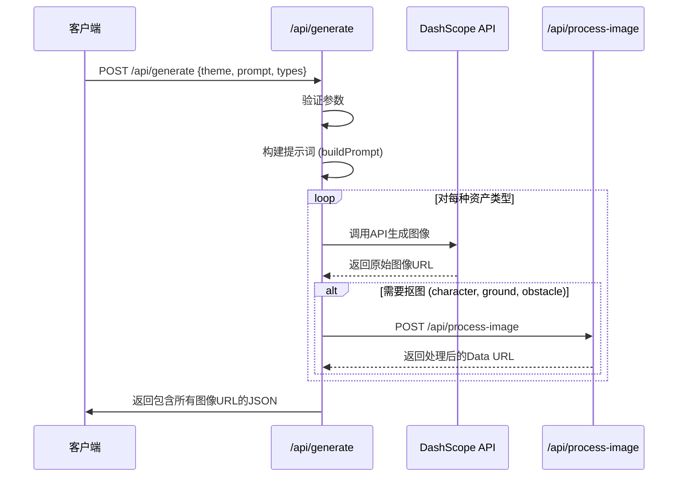
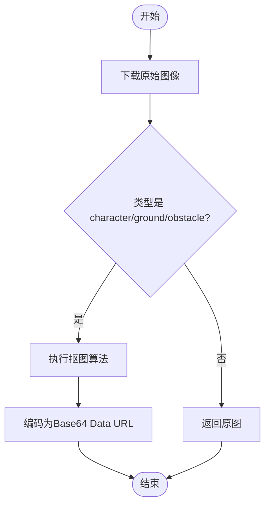

<cite>
**本文档中引用的文件**
- [route.ts](file://app/api/generate/route.ts)
- [route.ts](file://app/api/process-image/route.ts)
- [index.ts](file://configs/index.ts)
</cite>

## 目录
1. [引言](#引言)
2. [核心接口 `/api/generate`](#核心接口-apigenerate)
3. [图像后处理接口 `/api/process-image`](#图像后处理接口-apiprocess-image)
4. [游戏模板提示词系统](#游戏模板提示词系统)
5. [请求示例](#请求示例)
6. [错误处理与重试机制](#错误处理与重试机制)

## 引言
本文档旨在详细说明AI生成系统中的两个核心API接口：`/api/generate` 和 `/api/process-image`。该系统利用大模型API（DashScope）并行生成符合2D像素风游戏要求的多种图像资产，并通过后处理服务确保图像质量。文档将深入解析接口的请求/响应结构、内部实现逻辑以及确保生成内容一致性的提示词系统。

## 核心接口 `/api/generate`

该接口是系统的核心，负责协调调用大模型API来生成游戏所需的全部视觉资产。

### HTTP方法与请求体
- **HTTP方法**: `POST`
- **端点**: `/api/generate`

**请求体结构 (JSON)**:
- `theme` (字符串, 必填): 游戏主题，如 "fantasy" 或 "cyberpunk"。
- `prompt` (字符串, 必填): 用户提供的详细描述，用于指导图像生成。
- `types` (字符串数组, 可选): 指定需要生成的资产类型，可选值包括 `'character'`, `'background'`, `'ground'`, `'obstacle'`。默认生成所有类型。
- `levelCount` (数字, 可选): 指定生成的关卡数量，默认为1。

**Section sources**
- [route.ts](file://app/api/generate/route.ts#L15-L348)

### 响应格式
成功响应返回一个包含生成结果的JSON对象。

```json
{
  "success": true,
  "data": {
    "characterUrl": "string", // 角色图像的Data URL
    "levels": [
      {
        "id": "string", // 关卡ID
        "characterUrl": "string", // (可选) 关卡特定角色图
        "backgroundUrl": "string", // 背景图像的Data URL
        "groundUrl": "string", // 地面图像的Data URL
        "obstacleUrl": "string", // 障碍物图像的Data URL
        "obstacles": [
          // 障碍物布局配置
        ]
      }
    ]
  },
  "generationId": "string",
  "timestamp": "string",
  "metadata": {
    "generationTime": "number",
    "levelCount": "number",
    "memoryUsed": "number"
  }
}
```

失败响应将返回一个包含错误信息的JSON对象和相应的HTTP状态码。

**Section sources**
- [route.ts](file://app/api/generate/route.ts#L260-L320)

### 内部实现逻辑
`/api/generate` 接口的实现逻辑是一个复杂的异步协调过程，其核心是并行调用DashScope API。

1.  **参数验证**: 首先验证 `theme` 和 `prompt` 等必填参数，并检查 `types` 数组的有效性。
2.  **构建提示词**: 使用 `buildPrompt` 函数，将用户输入的 `prompt` 与 `GAME_TEMPLATES` 中预设的正向提示词模板（如 `positive.character`）进行组合，生成最终的、符合游戏风格的提示词。
3.  **并行图像生成**: 对于 `types` 数组中的每一种资产类型，系统会：
    - 调用 `callDashScopeAPI` 函数。
    - 根据资产类型（`character`, `background` 等）确定合适的图像尺寸（`getSizeForType`）。
    - 向DashScope API发起POST请求，请求体中包含组合后的正向提示词、反向提示词（来自 `GAME_TEMPLATES.negative`）和图像尺寸。
4.  **后处理集成**: 对于生成的角色（`character`）、地面（`ground`）和障碍物（`obstacle`）图像，系统会自动调用 `/api/process-image` 接口进行抠图处理，以去除棋盘格背景。
5.  **关卡生成**: 如果 `levelCount` 大于1，系统会循环生成多个关卡，每个关卡都有独立的背景、地面和障碍物图像，并通过 `generateObstacleLayout` 函数随机生成障碍物布局。



**Diagram sources**
- [route.ts](file://app/api/generate/route.ts#L100-L250)

## 图像后处理接口 `/api/process-image`

该接口负责对生成的图像进行自动后处理，主要功能是去除背景。

### 功能说明
`/api/process-image` 接口的核心功能是**自动抠图**，特别是去除生成图像中常见的棋盘格（checkerboard）背景，使角色、地面和障碍物等游戏资产具有透明背景，便于在游戏引擎中使用。

### HTTP方法与请求体
- **HTTP方法**: `POST`
- **端点**: `/api/process-image`

**请求体结构 (JSON)**:
- `imageUrl` (字符串, 必填): 需要处理的原始图像的URL。
- `type` (字符串, 必填): 图像的类型，用于决定处理逻辑。

**Section sources**
- [route.ts](file://app/api/process-image/route.ts#L15-L184)

### 处理逻辑
1.  **下载图像**: 使用 `fetch` 下载 `imageUrl` 指向的图像，并将其转换为Buffer。
2.  **识别与抠图**: 利用 `sharp` 库处理图像数据。算法会扫描每个像素，如果其颜色与预设的棋盘格颜色（如浅灰、白色）在一定阈值内相似，则将其Alpha通道设置为0（透明）。
3.  **返回结果**: 处理完成后，将新的PNG图像编码为Base64 Data URL并返回。

**重要区别**: 该接口仅对 `character`, `ground`, `obstacle` 类型的图像进行抠图处理。`background` 类型的图像会直接返回原图，因为背景通常需要完整的画面。



**Diagram sources**
- [route.ts](file://app/api/process-image/route.ts#L50-L150)

## 游戏模板提示词系统

`GAME_TEMPLATES` 是确保生成内容高度一致且符合2D像素风游戏要求的核心配置。

### 正向提示词 (Positive Prompts)
位于 `GAME_TEMPLATES.positive`，为每种资产类型提供详细的、强制性的描述，以引导AI生成符合要求的图像。
- **角色 (character)**: 强调 "2D横版像素艺术角色"、"16位复古风格"、"高对比度颜色"、"手绘纹理"，并强制要求角色为 "完整全身精灵图"、"面向右侧"、"居中构图"，且背景必须是 "纯棋盘格图案"。
- **背景 (background)**: 描述为 "2D横版像素艺术背景"、"水平滚动构图"、"高饱和度深色调"，并明确要求 "无角色"。
- **地面 (ground)**: 除了基础描述，还特别强调 "Dead Cells启发的视觉风格"，并强制要求 "纹理必须100%填满整个图像区域，零空隙，零边距"，同时排除所有环境物体。
- **障碍物 (obstacle)**: 同样强调 "Dead Cells风格"，并**强制要求正面视图**（"Mandatory FLAT FRONTAL VIEW"），禁止任何透视、角度或旋转，确保其作为碰撞体的可用性。

### 反向提示词 (Negative Prompts)
位于 `GAME_TEMPLATES.negative`，明确列出需要排除的元素，防止AI生成不符合要求的内容。
- **角色**: 排除 "3D渲染"、"写实风格"、"低分辨率"、"模糊"、"现代UI元素"、"矢量艺术"、"动漫风格"，以及所有 "环境物体"、"装饰品"、"植物"、"建筑" 等。特别排除 "正面视角"、"背面视角"、"四分之三视角"、"对角姿势"、"特写"、"肢体被裁剪" 和 "面向左侧"。
- **背景**: 主要排除所有 "角色"、"人物"、"生物" 及其相关装备。
- **地面**: 在排除角色和环境物体的基础上，还排除了 "复杂地质构造"、"矿脉"、"详细分层" 等，并特别强调不能有 "空隙"、"空白区域"、"透明区域" 或 "棋盘格背景可见"。
- **障碍物**: 除了排除角色和环境，还**极其严格地排除所有透视效果**，如 "任何透视失真"、"任何深度透视"、"等距视图"、"对角角度"、"倾斜视角"、"旋转视图" 等，确保生成的障碍物是完全扁平的2D精灵。

**Section sources**
- [index.ts](file://configs/index.ts#L7-L66)

## 请求示例

### 生成单个关卡的像素风游戏资产
```bash
curl -X POST http://localhost:3000/api/generate \
  -H "Content-Type: application/json" \
  -d '{
    "theme": "fantasy",
    "prompt": "A brave knight in shining armor",
    "types": ["character", "background", "ground", "obstacle"],
    "levelCount": 1
  }'
```

## 错误处理与重试机制

系统实现了健壮的错误处理和重试策略，以应对API调用失败。

### 重试机制
在 `callDashScopeAPI` 函数中，实现了针对速率限制（429状态码）的**指数退避重试**策略。
- **最大重试次数**: 3次。
- **退避算法**: 延迟时间 = 基础延迟 (2秒) * 2^重试次数。例如，第一次重试等待2秒，第二次等待4秒，第三次等待8秒。
- **触发条件**: 当DashScope API返回429状态码时，系统会自动按指数退避策略进行重试，直到成功或达到最大重试次数。

### 其他错误处理
- **后处理失败**: 在调用 `/api/process-image` 失败时，系统会捕获错误并记录警告，然后直接返回原始图像URL，保证主流程不中断。
- **内存监控**: 在生成多个关卡时，系统会监控内存使用情况。如果内存使用量异常增长，会尝试触发垃圾回收（`global.gc()`），以防止内存溢出。

**Section sources**
- [route.ts](file://app/api/generate/route.ts#L108-L137)