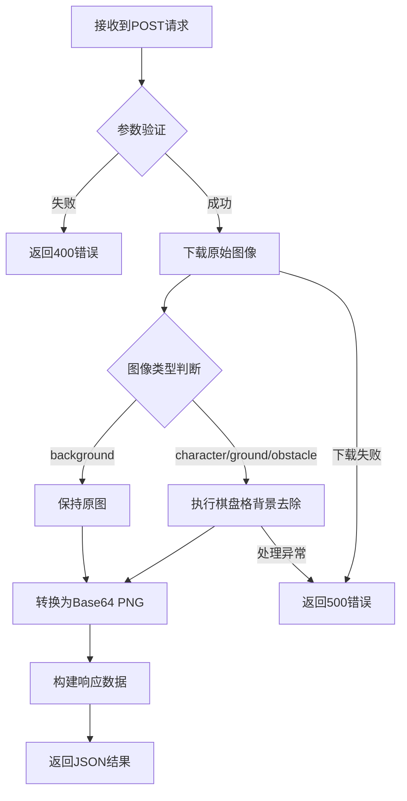
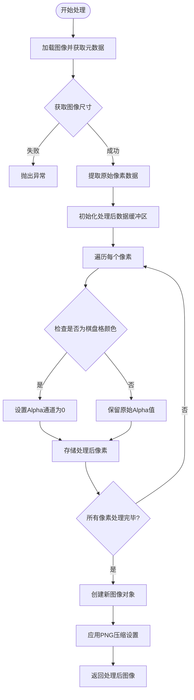
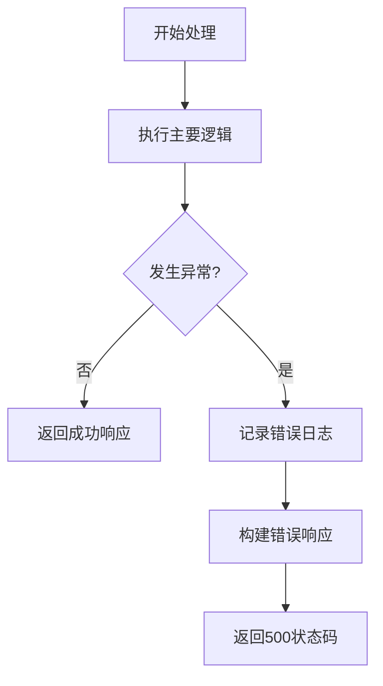
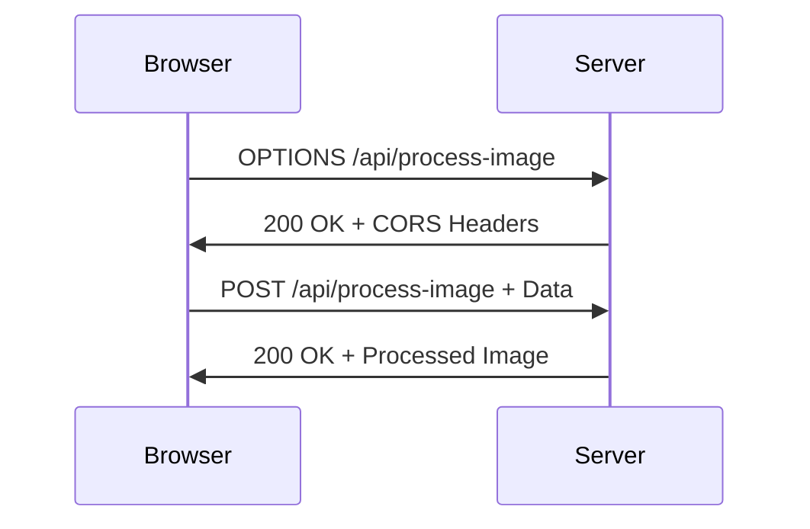

# 图像处理

<cite>
**Referenced Files in This Document**   
- [route.ts](file://app/api/process-image/route.ts)
- [route.ts](file://app/api/generate/route.ts)
- [next.config.ts](file://next.config.ts)
</cite>

## 目录
1. [简介](#简介)
2. [核心处理流程](#核心处理流程)
3. [棋盘格背景去除算法](#棋盘格背景去除算法)
4. [处理类型与策略](#处理类型与策略)
5. [输出格式与数据编码](#输出格式与数据编码)
6. [错误处理机制](#错误处理机制)
7. [跨域资源共享配置](#跨域资源共享配置)
8. [系统集成与调用流程](#系统集成与调用流程)

## 简介
本文档详细说明图像处理服务的核心功能，重点描述`/api/process-image`接口如何接收原始图像URL，下载图像数据，并使用Sharp库进行像素级处理。文档将深入解析`removeCheckerboardBackground`函数如何识别并去除棋盘格背景（浅灰与白色交替方格），将匹配的颜色区域设置为完全透明，从而实现自动抠图。同时，文档将解释为何仅对特定类型图像执行此操作，并涵盖错误处理和跨域配置等关键机制。

## 核心处理流程
图像处理服务通过`/api/process-image`端点接收POST请求，处理流程包括参数验证、图像下载、像素级处理和结果返回。服务首先验证请求中包含必需的`imageUrl`和`type`参数，然后从指定URL下载图像数据。根据图像类型，服务决定是否执行棋盘格背景去除处理。处理完成后，图像被转换为Base64编码的PNG数据URL格式返回。



**Diagram sources**
- [route.ts](file://app/api/process-image/route.ts#L106-L184)

**Section sources**
- [route.ts](file://app/api/process-image/route.ts#L106-L184)

## 棋盘格背景去除算法
`removeCheckerboardBackground`函数实现了核心的自动抠图功能，通过像素级分析识别并去除棋盘格背景。



**Diagram sources**
- [route.ts](file://app/api/process-image/route.ts#L20-L106)

**Section sources**
- [route.ts](file://app/api/process-image/route.ts#L20-L106)

### 算法实现细节
函数首先使用Sharp库加载图像并获取其元数据，包括宽度和高度。然后，图像被转换为原始RGBA格式，以便进行像素级操作。算法定义了棋盘格背景的特征颜色数组，包括浅灰色(204,204,204)、白色(255,255,255)、中灰色(192,192,192)和浅白色(240,240,240)。对于每个像素，算法计算其与这些特征颜色的欧几里得距离，如果距离小于阈值30，则判定该像素属于棋盘格背景，并将其Alpha通道设置为0（完全透明），从而实现背景去除。

## 处理类型与策略
服务根据`type`参数的不同值采用差异化的处理策略，以满足不同图像元素的特定需求。

### 处理类型定义
| 类型 | 描述 | 是否去除背景 | 处理策略 |
|------|------|------------|----------|
| character | 角色图像 | 是 | 执行棋盘格背景去除 |
| ground | 地面图像 | 是 | 执行棋盘格背景去除 |
| obstacle | 障碍物图像 | 是 | 执行棋盘格背景去除 |
| background | 背景图像 | 否 | 保持原图不变 |

**Section sources**
- [route.ts](file://app/api/process-image/route.ts#L158-L166)

### 策略选择原因
仅对角色、地面和障碍物执行背景去除操作，而保持背景图像原样，这是基于游戏场景构建的特定需求。角色、地面和障碍物需要精确的透明区域以实现与其他元素的无缝叠加，而背景图像本身作为最底层的视觉元素，通常包含完整的场景信息，不需要透明处理。这种差异化策略确保了游戏元素的正确层级关系和视觉效果。

## 输出格式与数据编码
处理服务返回标准化的JSON响应，包含处理结果和元数据。

### 响应数据结构
```json
{
  "success": true,
  "data": {
    "originalUrl": "https://example.com/original.png",
    "processedUrl": "data:image/png;base64,iVBORw0KGgoAAAANSUhEUg...",
    "type": "character"
  },
  "timestamp": "2024-01-01T00:00:00.000Z"
}
```

### 数据编码示例
处理前的原始图像数据（示例）：
```
https://example.com/character.png
```

处理后的Base64编码PNG数据URL：
```
data:image/png;base64,iVBORw0KGgoAAAANSUhEUgAAASwAAACCCAMAAADQNkiAAAAA1BMVEW...
```

**Section sources**
- [route.ts](file://app/api/process-image/route.ts#L170-L176)

## 错误处理机制
服务实现了全面的错误处理机制，确保在异常情况下仍能提供有意义的反馈。

### 错误类型与响应
| 错误类型 | HTTP状态码 | 响应内容 |
|---------|-----------|---------|
| 缺少必需参数 | 400 | {success: false, error: "Missing required parameters"} |
| 无效类型参数 | 400 | {success: false, error: "Invalid type: xxx"} |
| 下载失败 | 500 | {success: false, error: "Failed to download image: xx"} |
| 处理异常 | 500 | {success: false, error: "Unknown error occurred"} |

### 异常处理流程


**Section sources**
- [route.ts](file://app/api/process-image/route.ts#L178-L184)

## 跨域资源共享配置
服务配置了适当的CORS策略，以支持跨域调用。

### CORS头信息
- Access-Control-Allow-Origin: *
- Access-Control-Allow-Methods: POST, OPTIONS
- Access-Control-Allow-Headers: Content-Type

### OPTIONS请求处理
服务实现了OPTIONS请求处理函数，返回预检请求所需的头信息，允许浏览器在发送实际POST请求前确认跨域请求的可行性。此配置在`next.config.ts`中也进行了全局设置，确保所有API端点的一致性。



**Diagram sources**
- [route.ts](file://app/api/process-image/route.ts#L186-L194)
- [next.config.ts](file://next.config.ts#L14-L27)

**Section sources**
- [route.ts](file://app/api/process-image/route.ts#L186-L194)
- [next.config.ts](file://next.config.ts#L14-L27)

## 系统集成与调用流程
图像处理服务与其他系统组件紧密集成，形成完整的图像生成与处理流水线。

```mermaid
flowchart LR
A[生成服务] --> |调用| B[/api/process-image]
B --> C[Sharp图像处理]
C --> D[返回处理后图像]
D --> A
A --> E[游戏客户端]
```

`/api/generate`端点在生成游戏元素后，会自动调用`/api/process-image`对角色、地面和障碍物图像进行背景去除处理，确保生成的游戏资源符合使用要求。这种集成设计实现了图像生成与后处理的无缝衔接。

**Section sources**
- [route.ts](file://app/api/generate/route.ts#L58-L74)