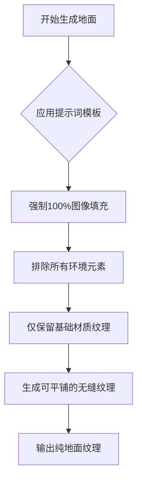
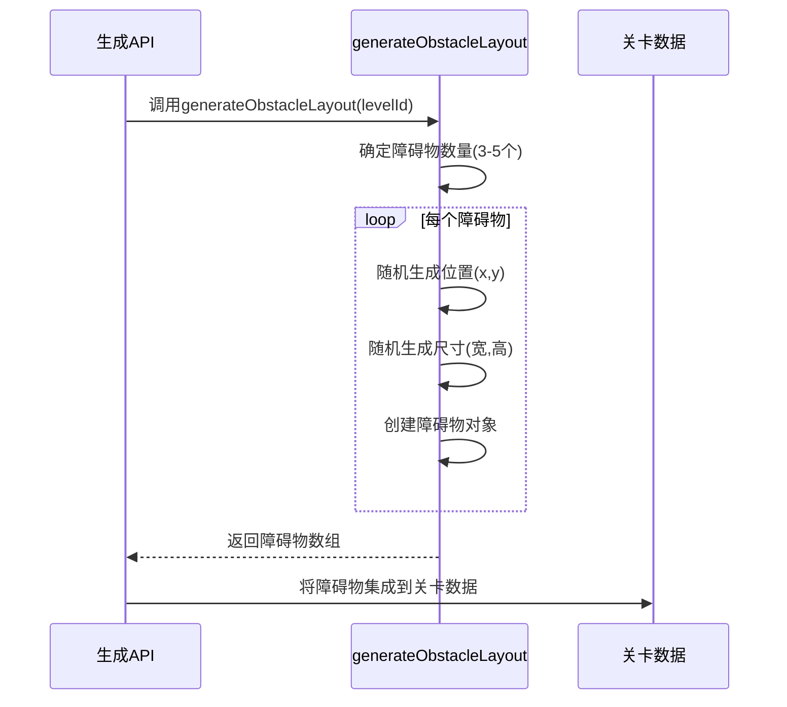
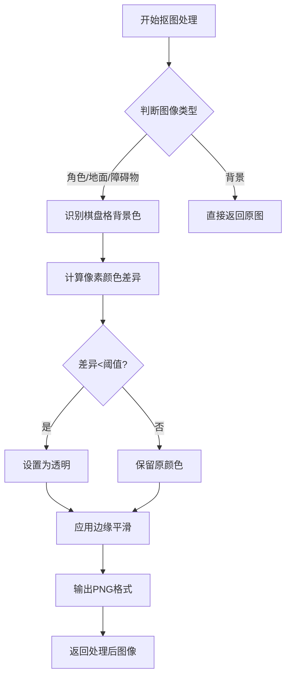
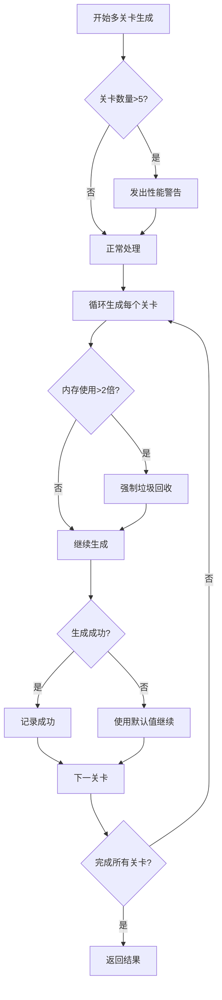

<cite>
**Referenced Files in This Document**  
- [configs/index.ts](file://configs/index.ts)
- [app/api/generate/route.ts](file://app/api/generate/route.ts)
- [app/api/process-image/route.ts](file://app/api/process-image/route.ts)
- [lib/store.ts](file://lib/store.ts)
</cite>

## 目录
1. [地面与障碍物生成](#地面与障碍物生成)
2. [地面生成逻辑](#地面生成逻辑)
3. [障碍物生成逻辑](#障碍物生成逻辑)
4. [自动抠图处理](#自动抠图处理)
5. [完整请求示例](#完整请求示例)
6. [多关卡性能分析](#多关卡性能分析)

## 地面与障碍物生成

本文档全面阐述了地面和障碍物的生成逻辑，涵盖从提示词模板设计、图像生成到后处理的完整流程。系统通过精确的提示词约束和自动化处理，确保生成的游戏资产符合2D横版像素风游戏引擎的需求。

**Section sources**
- [configs/index.ts](file://configs/index.ts#L1-L66)
- [app/api/generate/route.ts](file://app/api/generate/route.ts#L1-L349)

## 地面生成逻辑

地面生成的核心在于`GAME_TEMPLATES.positive.ground`提示词模板，该模板通过多层次的约束确保生成的地面纹理完全符合游戏开发需求。

### 无缝拼接与100%填充

`GAME_TEMPLATES.positive.ground`模板通过明确的指令强制实现图像区域的100%填充。其关键指令包括"**texture must completely fill 100% of the entire image area with zero empty space, zero margins, zero borders, extending to every single pixel edge with maximum coverage density**"，这确保了生成的纹理能够无缝拼接，没有任何空白区域或边距，满足游戏引擎对可平铺纹理的要求。

### 纯纹理与环境排除

该模板严格排除任何环境元素，确保生成的地面仅为纯纹理。通过"**COMPLETE ENVIRONMENTAL EXCLUSION: absolutely NO environmental objects, NO surface elements, NO decorative items, NO props, NO vegetation, NO plants, NO trees, NO grass, NO flowers, NO roots, NO structures, NO buildings, NO architecture**"等一系列否定性约束，系统强制AI模型仅生成基本的土壤层和岩石层等基础材质元素，避免生成任何植被、建筑或其他场景元素。



**Diagram sources**
- [configs/index.ts](file://configs/index.ts#L30-L60)

**Section sources**
- [configs/index.ts](file://configs/index.ts#L30-L60)

## 障碍物生成逻辑

障碍物生成逻辑通过`GAME_TEMPLATES.positive.obstacle`模板和`generateObstacleLayout`函数共同实现，确保生成的障碍物既符合视觉要求，又能正确集成到游戏关卡中。

### 正视图与2D碰撞体要求

`GAME_TEMPLATES.positive.obstacle`模板强制要求障碍物必须为正视图（orthographic projection），禁止任何透视角度。其关键指令包括"**CRITICAL FRONT VIEW ENFORCEMENT: NEVER diagonal view, NEVER side view, NEVER three-quarter view, NEVER angled perspective... MANDATORY FLAT FRONTAL VIEW with orthographic projection, EXCLUSIVELY straight-on direct view, ABSOLUTELY flat 2D presentation, zero perspective effects**"。这一系列约束确保生成的障碍物为2D平面图像，适合作为游戏中的碰撞体，避免因透视效果导致的物理引擎计算问题。

### 随机布局生成

`generateObstacleLayout`函数负责在游戏关卡中随机生成障碍物的位置、大小和形状。该函数为每个关卡生成3-5个障碍物，通过随机化x、y坐标、宽度和高度，创建多样化的关卡布局。生成的障碍物数据包含唯一ID、位置、尺寸和类型，可直接集成到关卡数据结构中。



**Diagram sources**
- [app/api/generate/route.ts](file://app/api/generate/route.ts#L151-L174)

**Section sources**
- [configs/index.ts](file://configs/index.ts#L60-L66)
- [app/api/generate/route.ts](file://app/api/generate/route.ts#L151-L174)

## 自动抠图处理

生成后的自动抠图处理是确保游戏资产质量的关键步骤，特别是对地面和障碍物进行透明化处理，以便在游戏引擎中正确叠加和渲染。

### 抠图必要性

自动抠图处理的必要性体现在去除生成图像中的棋盘格背景。系统通过`process-image` API端点调用`removeCheckerboardBackground`函数，识别并移除图像中的棋盘格模式（浅灰色和白色方块），将其转换为透明区域。这确保了游戏资产在导入引擎后能够正确与其他元素叠加，而不会显示不必要的背景图案。

### 处理流程

抠图处理流程首先下载原始图像，然后分析每个像素的颜色值。当像素颜色与棋盘格背景色（如浅灰色#CCCCCC和白色#FFFFFF）的差异小于设定阈值时，该像素被标记为背景并设置为透明。处理后的图像应用边缘平滑和噪点清理，确保透明边缘的视觉质量。



**Diagram sources**
- [app/api/process-image/route.ts](file://app/api/process-image/route.ts#L40-L120)

**Section sources**
- [app/api/process-image/route.ts](file://app/api/process-image/route.ts#L1-L185)

## 完整请求示例

以下是一个包含地面和障碍物生成的完整请求示例，展示了如何通过API调用生成多关卡游戏内容：

```json
{
  "theme": "fantasy",
  "prompt": "medieval castle style",
  "types": ["ground", "obstacle"],
  "levelCount": 3
}
```

该请求将生成3个关卡，每个关卡包含符合"medieval castle style"主题的地面纹理和障碍物。系统会为每个关卡调用相应的提示词模板，生成图像后自动进行抠图处理，并随机生成障碍物布局。

**Section sources**
- [app/api/generate/route.ts](file://app/api/generate/route.ts#L270-L300)

## 多关卡性能分析

系统在处理多关卡生成请求时，实现了有效的性能监控和资源管理策略。

### 性能监控

当`levelCount`参数大于5时，系统会发出性能警告，提醒用户大量关卡生成可能消耗显著的时间和资源。系统通过`console.warn`记录大型生成请求，帮助开发者监控潜在的性能瓶颈。

### 资源管理

系统实施了动态延迟策略，关卡越多，生成每个图像前的延迟越长，以避免API速率限制。同时，系统监控内存使用情况，当内存使用量超过初始值的两倍时，会尝试强制垃圾回收（如果环境支持），以防止内存泄漏。

### 错误处理

系统包含完善的错误处理机制，即使单个关卡生成失败，也会使用默认值继续生成后续关卡，确保整体请求不会因局部错误而完全失败。



**Diagram sources**
- [app/api/generate/route.ts](file://app/api/generate/route.ts#L270-L340)

**Section sources**
- [app/api/generate/route.ts](file://app/api/generate/route.ts#L270-L340)