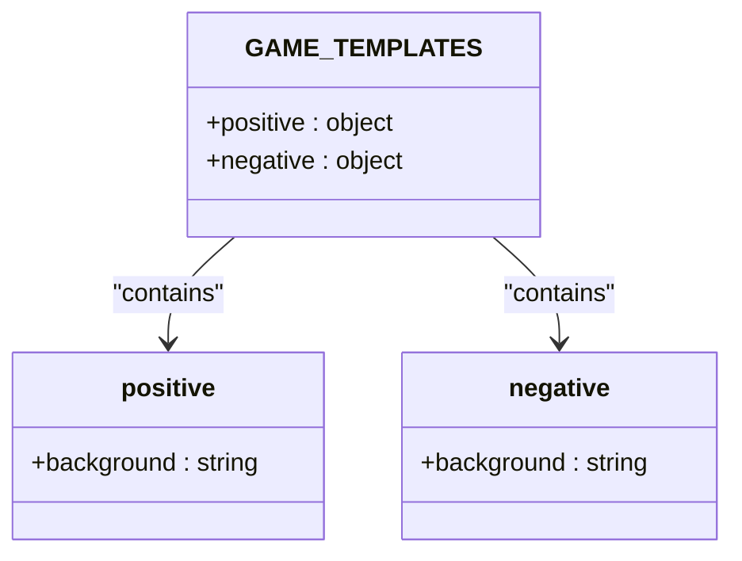
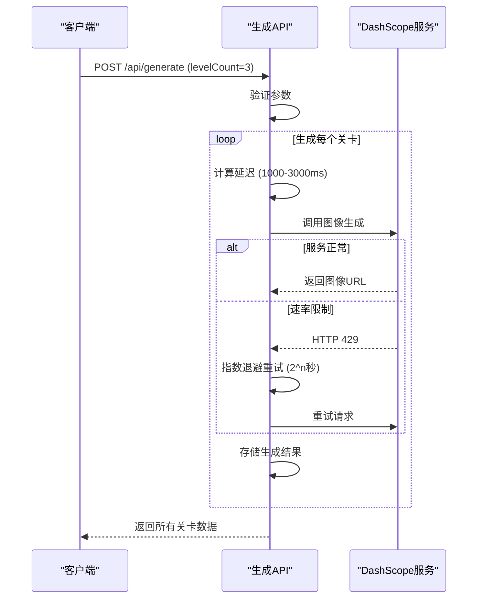
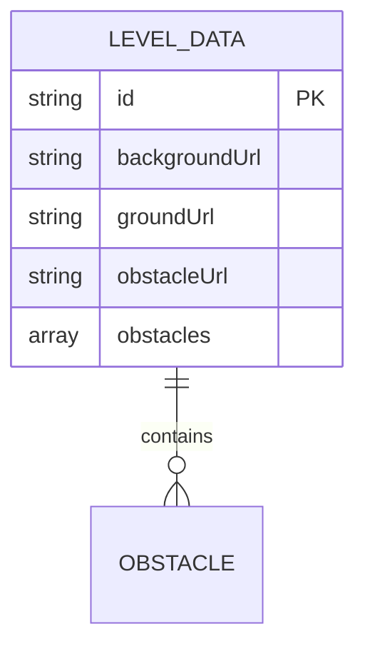

# 背景生成

<cite>
**Referenced Files in This Document**   
- [route.ts](file://app/api/generate/route.ts)
- [index.ts](file://configs/index.ts)
- [route.ts](file://app/api/process-image/route.ts)
- [index.ts](file://types/index.ts)
- [doc.html](file://public/doc.html)
</cite>

## 目录
1. [背景生成技术实现](#背景生成技术实现)
2. [提示词模板设计](#提示词模板设计)
3. [图像尺寸设计考量](#图像尺寸设计考量)
4. [多关卡生成延迟控制](#多关卡生成延迟控制)
5. [请求与响应结构](#请求与响应结构)
6. [内存监控与垃圾回收](#内存监控与垃圾回收)

## 背景生成技术实现

`/api/generate` 接口通过调用 DashScope AI 图像生成服务，为每个游戏关卡独立生成背景图像。该接口接收包含主题、提示词和关卡数量的请求，利用预设的提示词模板生成符合要求的像素风场景。

当用户发起生成请求时，系统首先验证输入参数的完整性与有效性。随后，对于每个关卡，系统会构建特定的提示词，调用 AI 服务生成图像，并通过指数退避算法处理可能的速率限制错误。生成的背景图像经过严格的质量控制，确保符合横版滚动的像素风游戏需求。

**Section sources**
- [route.ts](file://app/api/generate/route.ts#L149-L349)

## 提示词模板设计

系统通过 `GAME_TEMPLATES` 配置对象定义了严格的正向和反向提示词模板，确保生成的背景图像符合技术要求。

正向提示词 `GAME_TEMPLATES.positive.background` 明确要求生成"2D 横版滚动像素艺术背景"，强调"水平滚动构图"、"高饱和度深色调"和"分层视差元素"，同时明确排除任何角色或物体。反向提示词 `GAME_TEMPLATES.negative.background` 进一步强化了这一要求，明确禁止生成"角色"、"人物"、"生物"、"角色轮廓"等任何生命体或物体元素。

这种双重约束机制确保了生成的背景图像纯粹为环境场景，不含任何可交互的游戏对象，符合游戏设计需求。



**Diagram sources**
- [index.ts](file://configs/index.ts#L10-L100)

**Section sources**
- [index.ts](file://configs/index.ts#L10-L100)

## 图像尺寸设计考量

背景图像尺寸被设定为 1664*928 像素，这一宽屏比例的设计考量主要基于游戏的横向卷轴玩法需求。

该尺寸提供了足够的水平空间，以支持角色在关卡中的流畅移动和探索。1664 像素的宽度确保了在角色移动时，背景能够平滑滚动，提供连续的视觉体验，而 928 像素的高度则为游戏场景的垂直层次（如前景、中景、背景）提供了充足的空间。

这一特定尺寸与角色和地面图像的 1328*1328 正方形尺寸形成对比，体现了不同游戏元素的功能性设计差异：角色和地面需要正方形以保证无缝拼接和精确控制，而背景则需要宽屏以适配横向卷轴的视觉叙事。

**Section sources**
- [route.ts](file://app/api/generate/route.ts#L23-L36)

## 多关卡生成延迟控制

为防止 API 调用过于频繁导致服务限流，系统实现了智能的延迟控制机制。

当生成多个关卡时，系统会在生成每个关卡的图像前引入动态延迟。延迟时间根据关卡总数进行调整，计算公式为 `Math.min(1000 + (levelCount - 3) * 200 + Math.random() * 1000, 3000)`。这意味着关卡数量越多，延迟时间越长，最大不超过 3 秒。

此外，系统还实现了指数退避重试机制。当检测到速率限制错误（HTTP 429）时，系统会自动以 `2^n` 秒的延迟进行重试，最多重试 3 次，有效应对临时的 API 限流问题。



**Diagram sources**
- [route.ts](file://app/api/generate/route.ts#L228-L257)

**Section sources**
- [route.ts](file://app/api/generate/route.ts#L228-L257)

## 请求与响应结构

生成多关卡背景的请求示例如下：

```json
{
  "theme": "fantasy",
  "prompt": "A fantasy world of magic, dragons, castles, and forests",
  "types": ["background"],
  "levelCount": 3
}
```

响应结构中，`levels[n].backgroundUrl` 字段包含生成的背景图像 URL。完整的响应结构定义在 `types/index.ts` 中，确保了前后端数据交互的一致性。



**Diagram sources**
- [index.ts](file://types/index.ts#L10-L122)

**Section sources**
- [index.ts](file://types/index.ts#L10-L122)

## 内存监控与垃圾回收

在长时间的多关卡生成任务中，系统实施了内存监控与垃圾回收策略以防止内存泄漏。

系统在生成过程中定期检查内存使用情况，每生成两个关卡后进行一次检查。通过 `process.memoryUsage()` 获取当前内存占用，并与初始内存进行比较。如果内存使用量超过初始值的两倍，系统会尝试触发强制垃圾回收（`global.gc()`），以释放未使用的内存资源。

这一策略确保了在生成大量关卡时，服务能够保持稳定运行，避免因内存耗尽而导致的崩溃。

**Section sources**
- [route.ts](file://app/api/generate/route.ts#L255-L287)