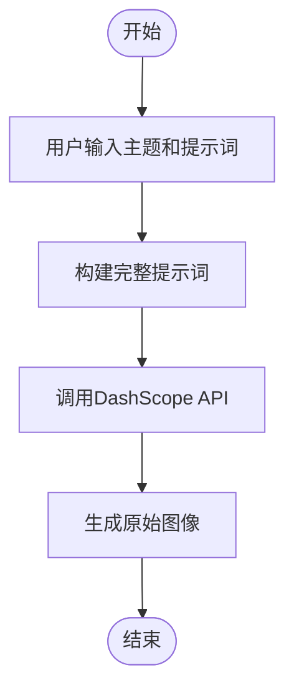
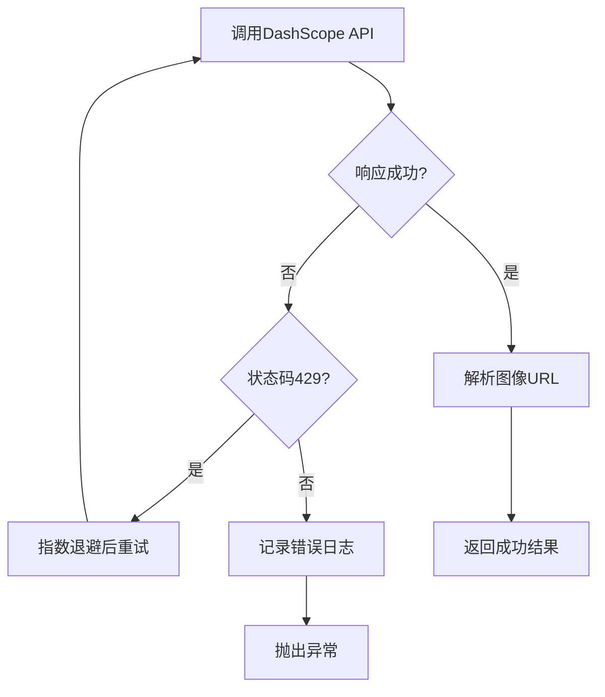

# 角色生成

<cite>
**本文档中引用的文件**  
- [route.ts](file://app/api/generate/route.ts)
- [route.ts](file://app/api/process-image/route.ts)
- [index.ts](file://configs/index.ts)
</cite>

## 目录
1. [角色生成机制概述](#角色生成机制概述)
2. [提示词模板与图像生成](#提示词模板与图像生成)
3. [图像尺寸设定原因](#图像尺寸设定原因)
4. [自动抠图处理流程](#自动抠图处理流程)
5. [请求示例与响应结构](#请求示例与响应结构)
6. [错误处理与重试机制](#错误处理与重试机制)
7. [性能优化策略](#性能优化策略)

## 角色生成机制概述

角色生成是通过调用 `/api/generate` 接口实现的，该接口接收用户输入的主题和提示词，结合预设的游戏模板，调用 DashScope API 生成符合 2D 像素风风格的角色图像。整个流程包括提示词构建、图像生成、尺寸设定、背景去除等多个步骤，确保最终输出可用于游戏的高质量角色资源。

**Section sources**
- [route.ts](file://app/api/generate/route.ts#L176-L336)

## 提示词模板与图像生成

系统使用 `GAME_TEMPLATES.positive.character` 和 `negative.character` 作为正向和反向提示词模板，结合用户输入的主题和自定义提示词，构建完整的生成指令。正向提示词定义了 2D 横版像素风角色的基本特征，如“16位复古风格”、“高对比度颜色”、“手绘纹理”等；反向提示词则排除了不符合要求的元素，如“3D渲染”、“现实风格”、“环境对象”、“左侧视角”等。

生成过程中，系统会将用户输入的 `theme` 和 `prompt` 与模板拼接，形成最终的提示词。例如，若用户选择“史诗魔幻”主题并输入“魔法战士”，系统将生成包含“2D横版像素艺术角色”、“魔法元素”、“中世纪盔甲”等描述的完整提示词。



**Diagram sources**
- [route.ts](file://app/api/generate/route.ts#L16-L20)
- [index.ts](file://configs/index.ts#L6-L66)

**Section sources**
- [route.ts](file://app/api/generate/route.ts#L16-L20)
- [index.ts](file://configs/index.ts#L6-L66)

## 图像尺寸设定原因

角色图像的尺寸被设定为 **1328*1328 正方形**，主要原因如下：

1. **适配游戏引擎需求**：正方形尺寸便于在 2D 游戏中进行旋转、缩放和动画处理，避免因宽高比不同导致的变形问题。
2. **统一资源格式**：地面和障碍物也采用相同尺寸，便于资源管理和无缝拼接。
3. **高分辨率输出**：1328px 提供足够细节，支持后续裁剪为 32x32 或 64x64 的像素精灵图。
4. **API 支持**：DashScope API 支持该尺寸输出，且在此分辨率下生成质量稳定。

其他类型图像的尺寸设定：
- 背景：1664*928（宽屏，适合横向滚动）
- 地面/障碍物：1328*1328（正方形，便于无缝拼接）

**Section sources**
- [route.ts](file://app/api/generate/route.ts#L23-L36)

## 自动抠图处理流程

生成的角色图像带有棋盘格背景，用于指示透明区域。系统在生成后自动调用 `/api/process-image` 接口进行抠图处理，去除棋盘格背景并转换为透明 PNG。

处理流程如下：
1. 下载原始图像
2. 识别棋盘格背景色（浅灰、白色等）
3. 将背景像素的 Alpha 通道设为 0（透明）
4. 保留非背景像素的原始颜色和透明度
5. 输出 Base64 编码的 Data URL

该处理仅对角色、地面和障碍物执行，背景图像保持原样。

```mermaid
sequenceDiagram
participant 生成接口 as /api/generate
participant 扣图接口 as /api/process-image
participant 图像库 as sharp
生成接口->>扣图接口 : POST {imageUrl, type : 'character'}
扣图接口->>图像库 : 下载图像并解析
图像库-->>扣图接口 : 返回图像数据
扣图接口->>扣图接口 : 遍历像素，识别棋盘格
扣图接口->>扣图接口 : 设置背景透明
扣图接口-->>生成接口 : 返回processedUrl (data : image/png;base64,...)
生成接口-->>前端 : 返回characterUrl
```

**Diagram sources**
- [route.ts](file://app/api/generate/route.ts#L39-L64)
- [route.ts](file://app/api/process-image/route.ts#L108-L172)

**Section sources**
- [route.ts](file://app/api/generate/route.ts#L39-L64)
- [route.ts](file://app/api/process-image/route.ts#L20-L106)

## 请求示例与响应结构

### 请求示例
```json
POST /api/generate
{
  "theme": "赛博朋克",
  "prompt": "机械义体战士",
  "types": ["character"],
  "levelCount": 1
}
```

### 响应结构
```json
{
  "success": true,
  "data": {
    "characterUrl": "data:image/png;base64,iVBORw0KGgoAAAANSUh...",
    "levels": []
  },
  "generationId": "gen_1712345678901",
  "timestamp": "2024-04-05T12:00:00.000Z",
  "metadata": {
    "generationTime": 12.34,
    "levelCount": 1,
    "memoryUsed": 85
  }
}
```

其中 `characterUrl` 字段为 Base64 编码的 PNG 图像，可直接用于 `` 或 Canvas 绘制，无需额外请求服务器资源。

**Section sources**
- [route.ts](file://app/api/generate/route.ts#L176-L336)

## 错误处理与重试机制

系统实现了完善的错误处理机制：

1. **参数验证**：检查 `theme`、`prompt` 是否为空，`levelCount` 是否在 1-10 范围内。
2. **API 调用异常捕获**：捕获网络错误、响应失败等情况。
3. **速率限制处理**：当 DashScope API 返回 429 状态码时，触发指数退避重试。
4. **部分失败容忍**：单个关卡生成失败时，使用默认障碍物布局继续生成其他关卡。
5. **图像处理失败降级**：若抠图失败，返回原始图像而非中断流程。



**Section sources**
- [route.ts](file://app/api/generate/route.ts#L67-L148)

## 性能优化策略

为提升系统稳定性和用户体验，采用了以下性能优化策略：

1. **指数退避算法**：重试延迟 = 2000 × 2^重试次数，避免频繁请求导致服务拒绝。
2. **动态延迟机制**：批量生成时，每关卡间添加 1-3 秒随机延迟，防止 API 限流。
3. **内存监控与垃圾回收**：定期检查内存使用，过高时触发 `global.gc()` 强制回收。
4. **并行生成优化**：不同类型资源可并行生成，提高效率。
5. **Base64 内联传输**：抠图后直接返回 Data URL，减少额外 HTTP 请求。

这些策略确保在高负载或网络不稳定情况下仍能稳定生成角色图像。

**Section sources**
- [route.ts](file://app/api/generate/route.ts#L67-L148)
- [route.ts](file://app/api/generate/route.ts#L176-L336)