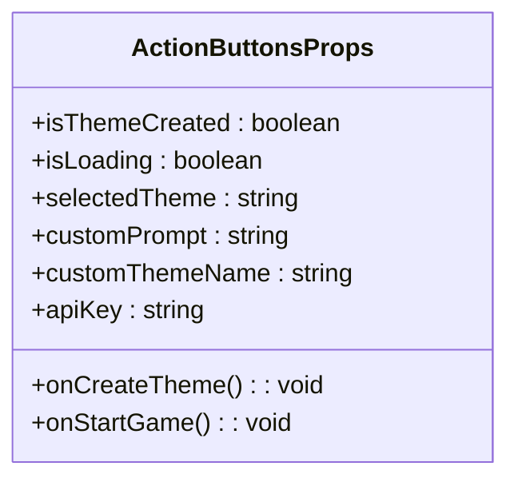
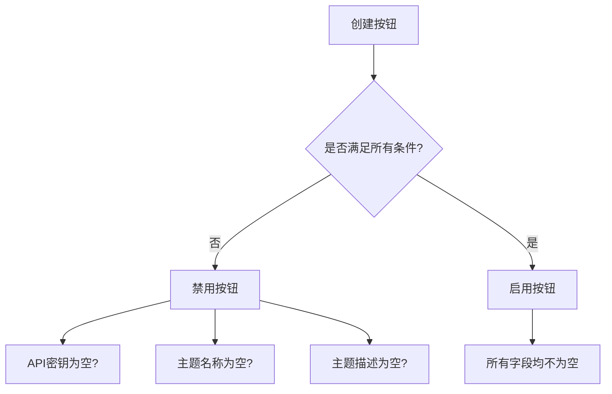
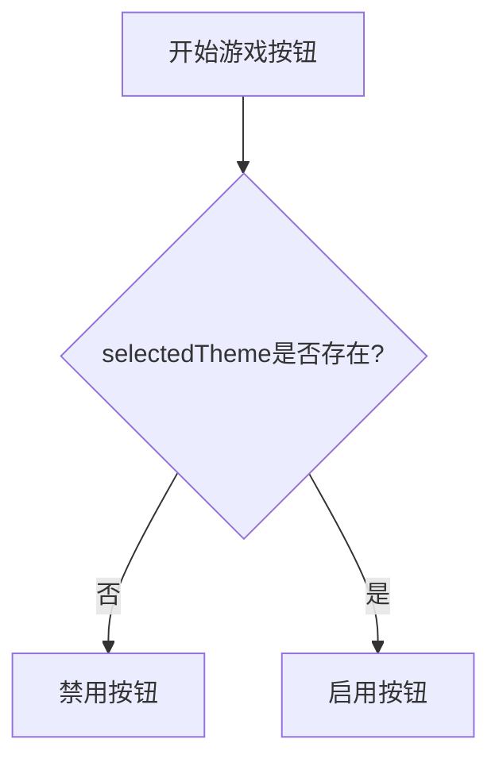
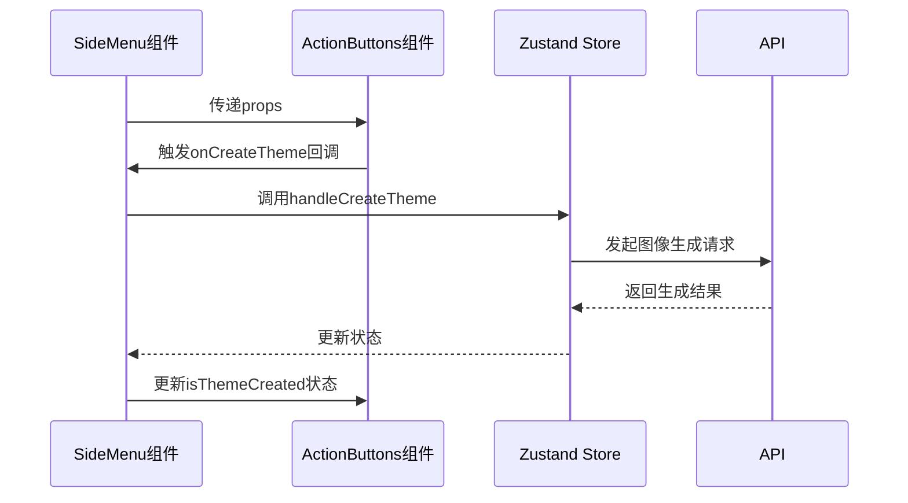
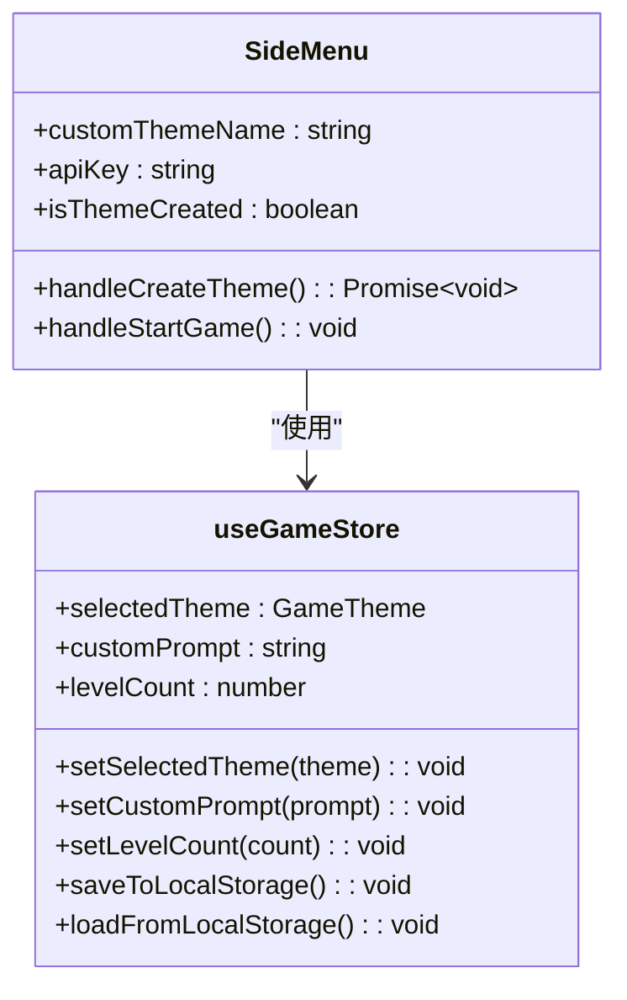
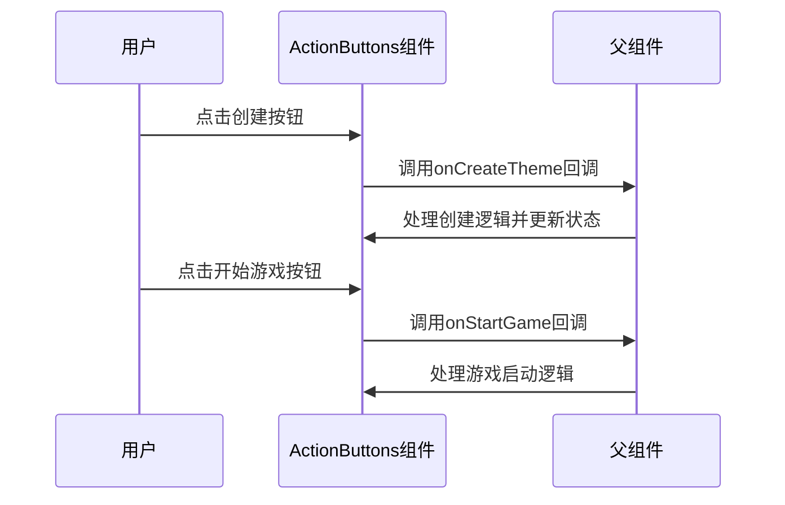
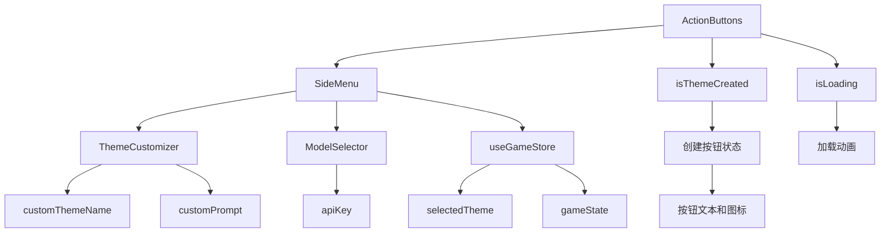

# ActionButtons组件

<cite>
**Referenced Files in This Document**   
- [ActionButtons.tsx](file://components/ui/ActionButtons.tsx)
- [SideMenu.tsx](file://components/SideMenu.tsx)
- [store.ts](file://lib/store.ts)
- [index.ts](file://types/index.ts)
</cite>

## 目录
1. [简介](#简介)
2. [核心功能](#核心功能)
3. [Props参数详解](#props参数详解)
4. [按钮禁用逻辑](#按钮禁用逻辑)
5. [在SideMenu中的使用](#在sidemenu中的使用)
6. [渲染逻辑与事件处理](#渲染逻辑与事件处理)
7. [状态依赖关系](#状态依赖关系)
8. [常见问题与解决方案](#常见问题与解决方案)
9. [结论](#结论)

## 简介

ActionButtons组件是像素种子游戏应用中的核心交互组件，位于侧边菜单底部，提供主题创建/重置和游戏启动两大核心功能。该组件通过直观的按钮界面，让用户能够轻松创建自定义游戏主题并启动游戏体验。组件设计简洁而功能完整，是连接用户输入与游戏生成的核心枢纽。

## 核心功能

ActionButtons组件包含两个主要功能按钮：

1. **主题创建/重置按钮**：根据`isThemeCreated`状态动态显示"Create Theme"或"Reset"文本，并配以Sparkles或RotateCcw图标，实现主题的创建与重置功能。
2. **开始游戏按钮**：提供游戏启动功能，点击后进入游戏界面，配以PlayCircleOutlined图标增强视觉识别。

```mermaid
flowchart TD
A[ActionButtons组件] --> B[主题创建/重置按钮]
A --> C[开始游戏按钮]
B --> D{isThemeCreated状态}
D --> |false| E[显示"Create Theme"+Sparkles图标]
D --> |true| F[显示"Reset"+RotateCcw图标]
C --> G[显示"Start Game"+PlayCircle图标]
```

**Diagram sources**
- [ActionButtons.tsx](file://components/ui/ActionButtons.tsx#L7-L42)

**Section sources**
- [ActionButtons.tsx](file://components/ui/ActionButtons.tsx#L7-L42)

## Props参数详解

ActionButtons组件接受8个关键Props参数，这些参数共同决定了组件的行为和状态：

| 参数 | 类型 | 描述 | 必需性 |
|------|------|------|------|
| isThemeCreated | boolean | 布尔值，控制创建按钮显示"Create Theme"还是"Reset" | 是 |
| isLoading | boolean | 加载状态，控制创建按钮的加载动画 | 是 |
| selectedTheme | string | 当前选中的主题ID，用于开始游戏按钮的启用判断 | 是 |
| customPrompt | string | 自定义主题描述，用于主题创建的输入验证 | 是 |
| customThemeName | string | 自定义主题名称，用于主题创建的输入验证 | 是 |
| apiKey | string | API密钥，用于身份验证和API调用 | 是 |
| onCreateTheme | () => void | 创建主题的回调函数，点击创建按钮时触发 | 是 |
| onStartGame | () => void | 开始游戏的回调函数，点击开始游戏按钮时触发 | 是 |



**Diagram sources**
- [index.ts](file://types/index.ts#L66-L75)

**Section sources**
- [index.ts](file://types/index.ts#L66-L75)

## 按钮禁用逻辑

组件实现了精细的按钮禁用逻辑，确保用户在满足条件时才能执行相应操作：

### 创建按钮禁用逻辑
创建按钮的禁用状态由三个条件共同决定，只有当所有条件都满足时按钮才可点击：
- API密钥不为空
- 自定义主题名称不为空  
- 自定义主题描述不为空



**Section sources**
- [ActionButtons.tsx](file://components/ui/ActionButtons.tsx#L18-L27)

### 开始游戏按钮禁用逻辑
开始游戏按钮的启用条件相对简单，仅依赖于`selectedTheme`是否存在。当用户成功创建或选择了一个主题后，该按钮才会变为可点击状态。



**Section sources**
- [ActionButtons.tsx](file://components/ui/ActionButtons.tsx#L33-L38)

## 在SideMenu中的使用

ActionButtons组件在SideMenu中扮演着关键角色，通过Zustand状态管理库与全局状态进行交互，实现复杂的状态管理和数据流控制。

### 组件集成
在SideMenu组件中，ActionButtons被作为子组件集成，接收来自父组件的各种状态和回调函数：



**Diagram sources**
- [SideMenu.tsx](file://components/SideMenu.tsx#L274-L278)

**Section sources**
- [SideMenu.tsx](file://components/SideMenu.tsx#L274-L278)

### 状态管理机制
SideMenu组件通过`useGameStore` Hook与全局状态进行交互，实现了状态的集中管理和持久化：



**Diagram sources**
- [SideMenu.tsx](file://components/SideMenu.tsx#L42-L59)
- [store.ts](file://lib/store.ts#L129-L312)

**Section sources**
- [SideMenu.tsx](file://components/SideMenu.tsx#L42-L59)
- [store.ts](file://lib/store.ts#L129-L312)

## 渲染逻辑与事件处理

### 渲染逻辑
组件采用React函数式组件模式，使用Ant Design的Space和Button组件构建垂直布局的按钮组。通过条件渲染实现按钮文本和图标的动态切换：

```mermaid
flowchart TD
A[组件渲染] --> B{isThemeCreated为false?}
B --> |是| C[渲染"Create Theme"+Sparkles图标]
B --> |否| D[渲染"Reset"+RotateCcw图标]
A --> E[渲染"Start Game"+PlayCircle图标]
```

**Section sources**
- [ActionButtons.tsx](file://components/ui/ActionButtons.tsx#L15-L39)

### 事件处理机制
组件通过回调函数机制处理用户交互，将事件处理逻辑委托给父组件：



**Section sources**
- [ActionButtons.tsx](file://components/ui/ActionButtons.tsx#L18-L37)

## 状态依赖关系

ActionButtons组件的状态与其他组件和全局状态存在复杂的依赖关系，这些关系确保了应用的一致性和响应性：



**Diagram sources**
- [ActionButtons.tsx](file://components/ui/ActionButtons.tsx#L7-L42)
- [SideMenu.tsx](file://components/SideMenu.tsx#L33-L295)

**Section sources**
- [ActionButtons.tsx](file://components/ui/ActionButtons.tsx#L7-L42)
- [SideMenu.tsx](file://components/SideMenu.tsx#L33-L295)

## 常见问题与解决方案

### 问题1：创建按钮始终禁用
**原因**：API密钥、自定义主题名称或自定义主题描述为空。
**解决方案**：确保三个输入字段均填写有效内容，特别是API密钥需要正确输入。

### 问题2：开始游戏按钮无法点击
**原因**：未成功创建或选择主题。
**解决方案**：先点击"Create Theme"按钮创建主题，等待创建成功后再尝试开始游戏。

### 问题3：状态更新不及时
**原因**：父组件未正确传递更新后的props。
**解决方案**：确保父组件在状态变更后正确调用`setIsThemeCreated`等状态更新函数。

### 问题4：回调函数未触发
**原因**：父组件未正确传递onCreateTheme或onStartGame回调函数。
**解决方案**：检查父组件是否正确定义并传递了回调函数。

## 结论

ActionButtons组件作为像素种子游戏应用的核心交互组件，通过简洁的界面设计和精细的状态管理，实现了主题创建/重置和游戏启动两大核心功能。组件通过合理的Props设计和禁用逻辑，确保了用户体验的流畅性和操作的准确性。与SideMenu组件和Zustand全局状态的紧密集成，使得组件能够响应复杂的应用状态变化，为用户提供一致且可靠的操作体验。