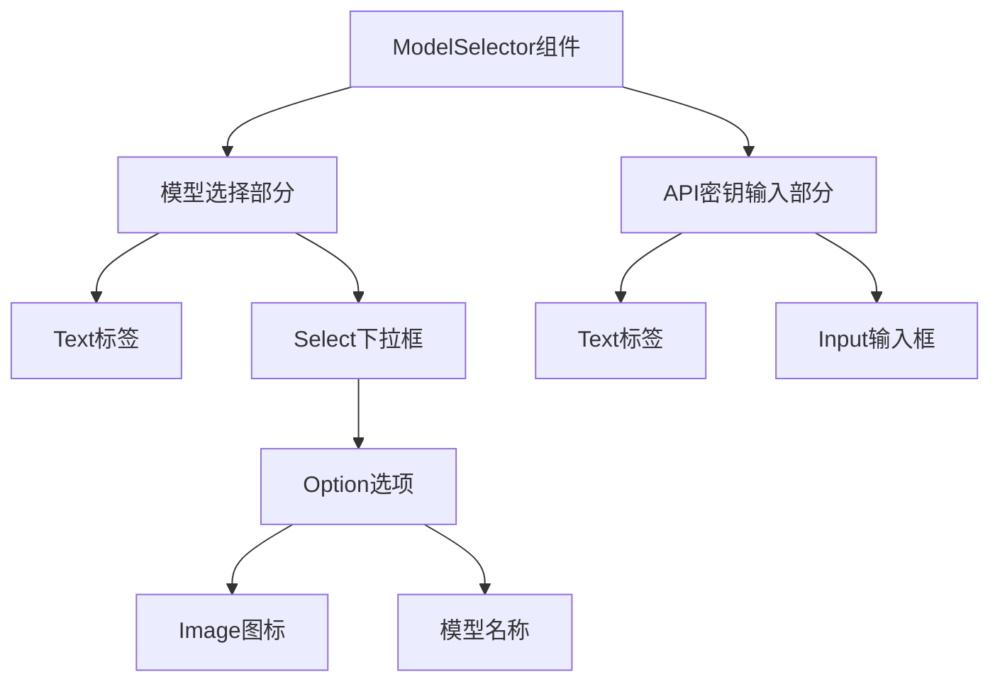
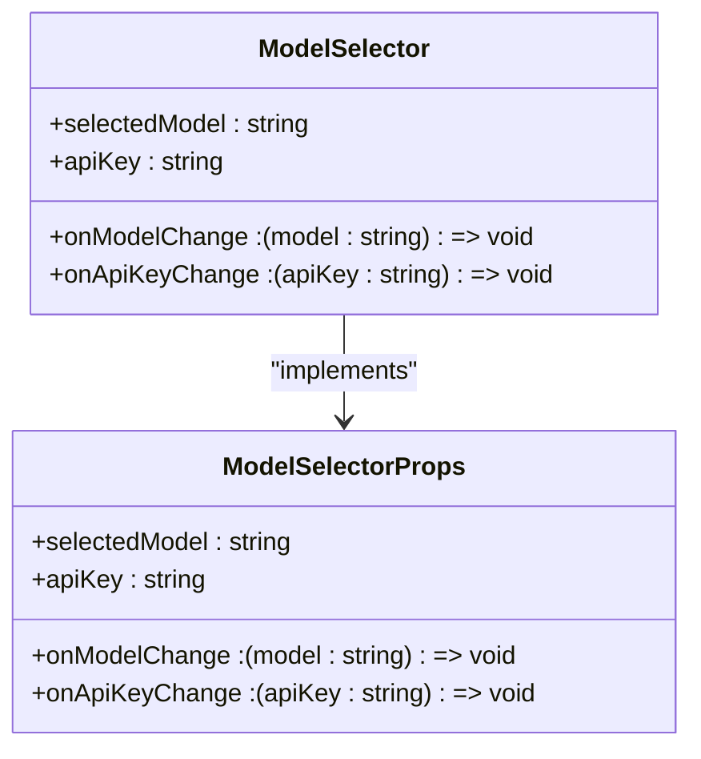
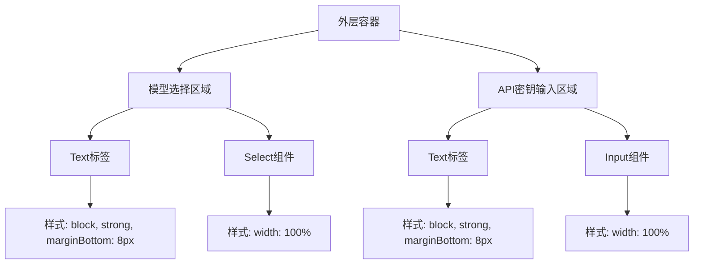
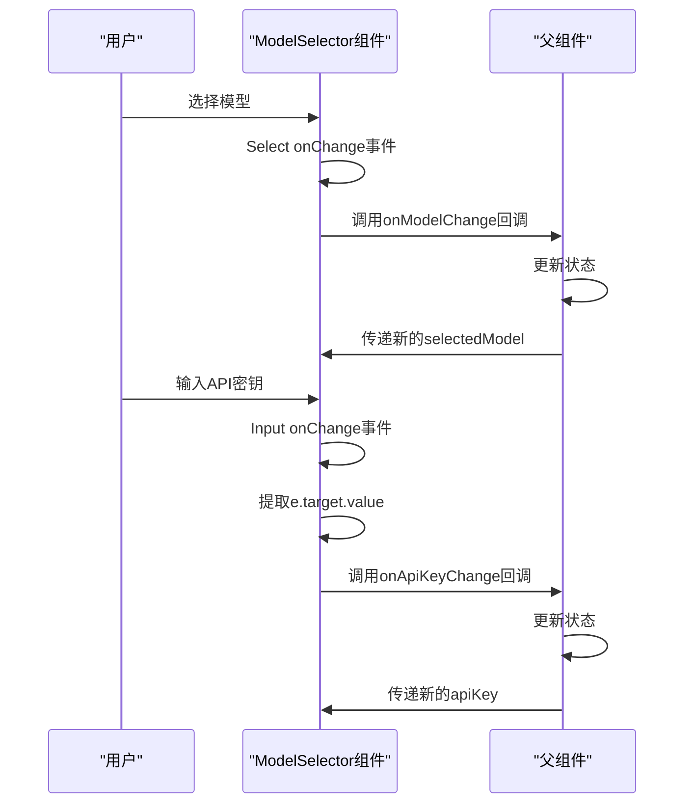
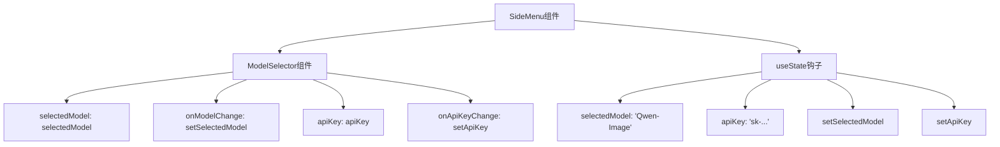

# ModelSelector组件

<cite>
**Referenced Files in This Document**   
- [ModelSelector.tsx](file://components/ui/ModelSelector.tsx)
- [index.ts](file://types/index.ts)
- [SideMenu.tsx](file://components/SideMenu.tsx)
- [store.ts](file://lib/store.ts)
</cite>

## Table of Contents
1. [组件概述](#组件概述)
2. [组件结构](#组件结构)
3. [Props参数说明](#props参数说明)
4. [UI布局与样式](#ui布局与样式)
5. [事件处理流程](#事件处理流程)
6. [状态同步机制](#状态同步机制)
7. [与全局Store的集成](#与全局store的集成)
8. [使用示例](#使用示例)
9. [未来扩展路径](#未来扩展路径)

## 组件概述

ModelSelector组件是一个用于AI模型选择和API密钥输入的复合组件。该组件主要包含两个功能部分：模型选择下拉框和API密钥输入框。组件采用Ant Design UI库构建，通过TypeScript定义了清晰的接口规范，实现了良好的类型安全性和可维护性。组件设计遵循React函数式组件的最佳实践，通过props接收外部状态和回调函数，实现了单向数据流的模式。

**Section sources**
- [ModelSelector.tsx](file://components/ui/ModelSelector.tsx#L1-L50)

## 组件结构

ModelSelector组件由两个主要部分构成：模型选择区域和API密钥输入区域。组件使用Ant Design的Select组件实现模型选择功能，目前仅支持Qwen-Image模型选项。在选项渲染时，通过Next.js的Image组件显示模型图标，增强了用户界面的可视化效果。API密钥输入功能则使用Ant Design的Input组件实现，提供了标准的文本输入体验。

组件的结构设计体现了模块化思想，将相关功能分组在独立的div容器中，每个部分都有清晰的标签和输入控件。这种结构不仅提高了代码的可读性，也便于后续的维护和扩展。



**Diagram sources**
- [ModelSelector.tsx](file://components/ui/ModelSelector.tsx#L10-L47)

**Section sources**
- [ModelSelector.tsx](file://components/ui/ModelSelector.tsx#L1-L50)

## Props参数说明

ModelSelector组件通过ModelSelectorProps接口定义了四个关键的props参数，实现了与父组件的双向数据绑定。

- **selectedModel**: 字符串类型，表示当前选中的模型值。该值通过props从父组件传递到ModelSelector组件，用于控制Select组件的当前选中状态。
- **onModelChange**: 回调函数类型，用于处理模型变更事件。当用户在下拉框中选择不同的模型时，该回调函数会被触发，通知父组件模型选择已更改。
- **apiKey**: 字符串类型，表示当前的API密钥值。该值同样从父组件传递，用于初始化Input组件的显示内容。
- **onApiKeyChange**: 回调函数类型，用于处理API密钥变更事件。当用户在输入框中输入或修改API密钥时，该回调函数会被调用，将最新的密钥值传递给父组件。

这些props参数的设计遵循了React受控组件的模式，确保了组件状态的可预测性和可管理性。



**Diagram sources**
- [index.ts](file://types/index.ts#L48-L53)

**Section sources**
- [index.ts](file://types/index.ts#L48-L53)
- [ModelSelector.tsx](file://components/ui/ModelSelector.tsx#L9-L47)

## UI布局与样式

ModelSelector组件采用垂直排列的布局方式，通过div容器包裹两个主要部分。每个部分都使用内联样式实现了清晰的视觉层次。组件使用Text组件作为标签显示，通过设置`strong`属性和`display: 'block'`样式，确保了标签的突出显示和块级布局。

在样式设计上，组件使用了简洁的内联样式对象，为Select和Input组件设置了`width: '100%'`，使其能够自适应容器宽度。模型选择部分的Option选项使用了flex布局，通过`alignItems: 'center'`和`gap: '8px'`实现了图标与文本的水平对齐和适当的间距。



**Diagram sources**
- [ModelSelector.tsx](file://components/ui/ModelSelector.tsx#L10-L47)

**Section sources**
- [ModelSelector.tsx](file://components/ui/ModelSelector.tsx#L1-L50)

## 事件处理流程

ModelSelector组件的事件处理流程体现了React的事件驱动特性。对于模型选择部分，Select组件的onChange事件被绑定到onModelChange回调函数。当用户选择不同的模型时，Ant Design的Select组件会触发onChange事件，将选中的模型值作为参数传递给onModelChange回调函数。

对于API密钥输入部分，Input组件的onChange事件被绑定到一个内联箭头函数，该函数提取事件对象中的target.value（即输入框的当前值），然后调用onApiKeyChange回调函数。这种设计模式确保了输入值的实时同步，同时保持了组件的轻量化。

事件处理流程的关键在于保持了组件的无状态性，所有状态变更都通过回调函数通知父组件，由父组件负责状态管理，这符合React单向数据流的设计原则。



**Diagram sources**
- [ModelSelector.tsx](file://components/ui/ModelSelector.tsx#L10-L47)

**Section sources**
- [ModelSelector.tsx](file://components/ui/ModelSelector.tsx#L1-L50)

## 状态同步机制

ModelSelector组件采用了受控组件（Controlled Component）的设计模式，实现了与父组件的状态同步。在这种模式下，组件本身不维护内部状态，而是完全依赖于通过props传递的外部状态。

当父组件的状态发生变化时，新的props会被传递给ModelSelector组件，触发组件的重新渲染。同时，当用户与组件交互时（如选择模型或输入API密钥），组件通过回调函数通知父组件，由父组件更新其状态。这种双向绑定机制确保了状态的一致性和可预测性。

组件的状态同步机制还体现了单一数据源原则，即所有状态都存储在父组件或全局状态管理器中，避免了状态的分散和不一致。

**Section sources**
- [ModelSelector.tsx](file://components/ui/ModelSelector.tsx#L1-L50)

## 与全局Store的集成

ModelSelector组件通过SideMenu组件与全局Zustand store进行集成。在SideMenu组件中，使用useState钩子创建了本地状态变量selectedModel和apiKey，并将这些状态的setter函数（setSelectedModel和setApiKey）作为回调函数传递给ModelSelector组件。

这种集成方式实现了状态的分层管理：全局store负责管理应用的核心状态（如selectedTheme、customPrompt等），而局部状态（如selectedModel、apiKey）则在组件层级中管理。当需要将这些局部状态持久化或与其他组件共享时，可以通过额外的逻辑将其同步到全局store中。

```mermaid
classDiagram
class SideMenu {
+selectedModel : string
+apiKey : string
+setSelectedModel : (model : string) => void
+setApiKey : (key : string) => void
}
class ModelSelector {
+selectedModel : string
+onModelChange : (model : string) => void
+apiKey : string
+onApiKeyChange : (apiKey : string) => void
}
class Store {
+selectedTheme : GameTheme
+customPrompt : string
+setSelectedTheme : (theme : GameTheme) => void
+setCustomPrompt : (prompt : string) => void
}
SideMenu --> ModelSelector : "传递props"
SideMenu --> Store : "使用useGameStore"
ModelSelector -.-> SideMenu : "回调通知"
```

**Diagram sources**
- [SideMenu.tsx](file://components/SideMenu.tsx#L33-L295)
- [store.ts](file://lib/store.ts#L1-L312)

**Section sources**
- [SideMenu.tsx](file://components/SideMenu.tsx#L33-L295)
- [store.ts](file://lib/store.ts#L1-L312)

## 使用示例

ModelSelector组件在SideMenu组件中被实例化和使用。父组件通过传递selectedModel、onModelChange、apiKey和onApiKeyChange四个props来配置ModelSelector组件。这种使用方式展示了如何在表单中集成此组件，实现模型选择和API密钥输入的功能。



**Diagram sources**
- [SideMenu.tsx](file://components/SideMenu.tsx#L33-L295)

**Section sources**
- [SideMenu.tsx](file://components/SideMenu.tsx#L33-L295)

## 未来扩展路径

尽管目前ModelSelector组件仅支持Qwen-Image模型，但其设计为未来的多模型扩展提供了良好的基础。要实现多模型支持，可以采取以下路径：

1. **扩展模型选项**: 在Select组件中添加更多的Option元素，每个Option对应一个不同的AI模型，如GPT-4、Claude等。
2. **动态模型配置**: 将模型列表提取到配置文件中，实现模型选项的动态加载和管理。
3. **模型元数据**: 为每个模型添加详细的元数据，如模型描述、性能指标、价格信息等，丰富用户的选择依据。
4. **条件渲染**: 根据选中的模型类型，动态显示不同的配置选项或输入字段。
5. **API密钥管理**: 实现针对不同模型的API密钥管理，允许用户为每个模型配置独立的密钥。

这些扩展路径可以在不破坏现有API的情况下逐步实现，体现了组件设计的前瞻性和可扩展性。

**Section sources**
- [ModelSelector.tsx](file://components/ui/ModelSelector.tsx#L1-L50)