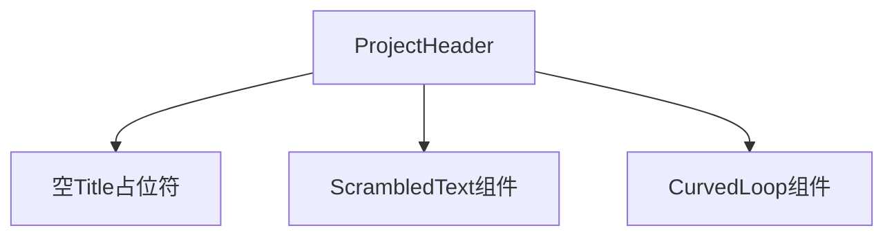
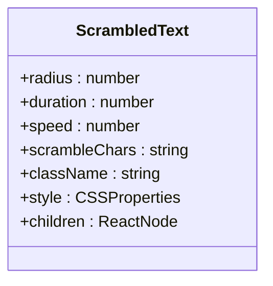
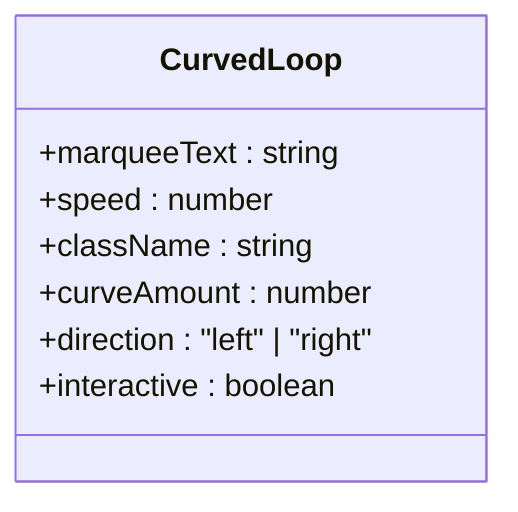
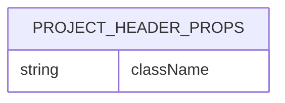
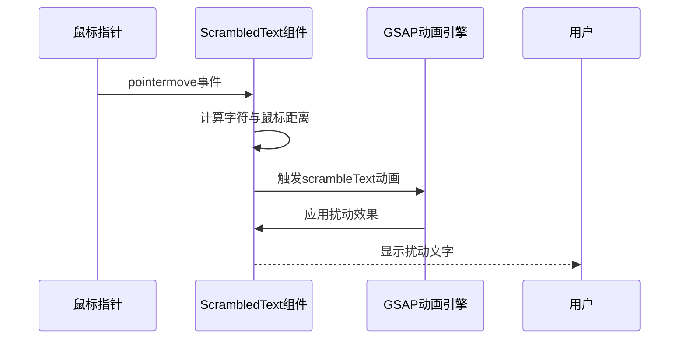
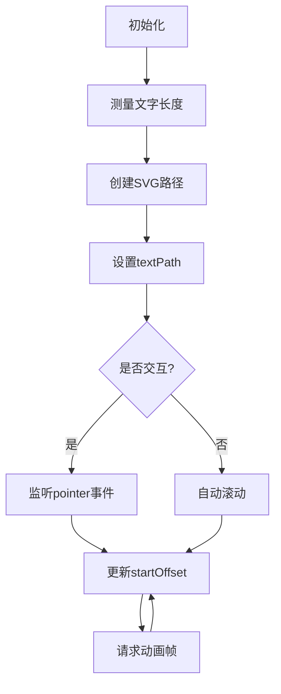
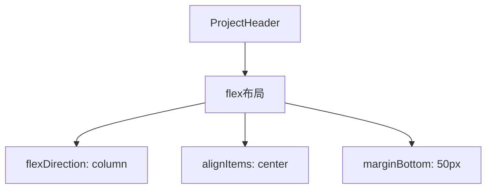
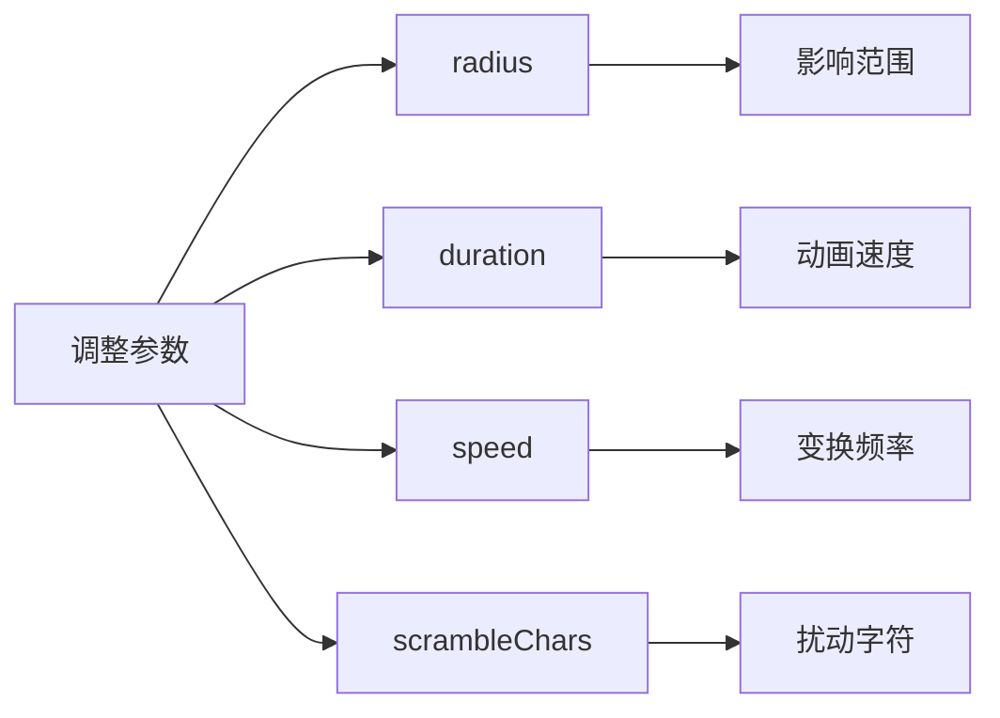
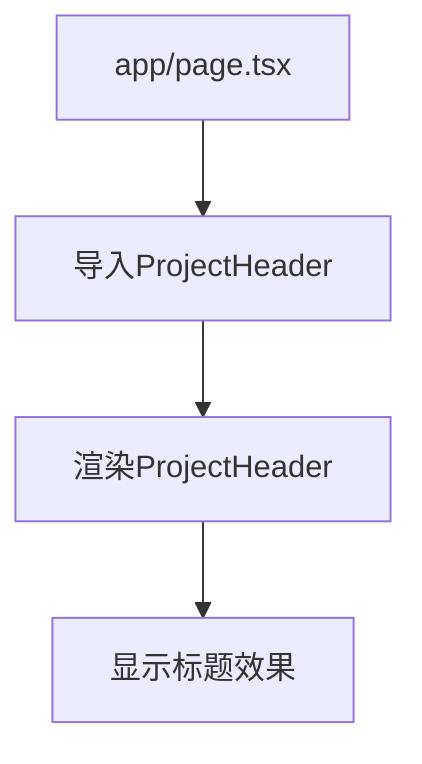

# ProjectHeader组件

<cite>
**Referenced Files in This Document**  
- [ProjectHeader.tsx](file://components/ui/ProjectHeader.tsx)
- [ScrambleText/index.tsx](file://components/ui/ScrambleText/index.tsx)
- [CurvedLoop/index.tsx](file://components/ui/CurvedLoop/index.tsx)
- [index.ts](file://types/index.ts)
- [page.tsx](file://app/page.tsx)
</cite>

## 目录
1. [简介](#简介)
2. [组件结构](#组件结构)
3. [子组件集成](#子组件集成)
4. [Props参数说明](#props参数说明)
5. [动画效果实现原理](#动画效果实现原理)
6. [样式与布局](#样式与布局)
7. [动画参数调整](#动画参数调整)
8. [页面集成方式](#页面集成方式)

## 简介
ProjectHeader组件是项目中的标题区域核心组件，负责展示项目品牌标识和装饰性文字效果。该组件通过集成ScrambledText和CurvedLoop两个子组件，实现了动态文字扰动和曲线滚动文字的视觉效果，为用户提供了引人注目的界面入口。

## 组件结构

ProjectHeader组件采用简洁的函数式组件结构，主要由三个视觉元素构成：一个空的Title占位符、ScrambledText组件和CurvedLoop组件。组件使用flex布局进行垂直排列，确保内容在页面中居中对齐。

**Diagram sources**  
- [ProjectHeader.tsx](file://components/ui/ProjectHeader.tsx#L9-L33)

**Section sources**  
- [ProjectHeader.tsx](file://components/ui/ProjectHeader.tsx#L1-L35)

## 子组件集成

### ScrambledText组件集成
ProjectHeader组件集成了ScrambledText子组件来显示"PIXEL SEED"文字，通过配置特定属性实现文字扰动动画效果。该组件利用GSAP动画库实现鼠标悬停时的文字扰动效果。

**Diagram sources**  
- [ScrambleText/index.tsx](file://components/ui/ScrambleText/index.tsx#L19-L83)

### CurvedLoop组件集成
CurvedLoop组件用于显示"Grow infinite pixel worlds with an AI seed ✦"的滚动文字效果，作为页面的装饰性元素。该组件使用SVG路径和textPath实现文字沿曲线滚动的动画效果。

**Diagram sources**  
- [CurvedLoop/index.tsx](file://components/ui/CurvedLoop/index.tsx#L20-L170)

## Props参数说明

ProjectHeader组件接受一个可选的props参数，用于外部样式定制。

| 参数名 | 类型 | 默认值 | 描述 |
|-------|------|--------|------|
| className | string | undefined | 外部传入的CSS类名，用于样式覆盖和定制 |

**Section sources**  
- [index.ts](file://types/index.ts#L110-L112)

## 动画效果实现原理

### 文字扰动动画原理
ScrambledText组件的动画效果基于GSAP库的ScrambleTextPlugin实现。当鼠标指针进入组件区域时，系统会计算每个字符与鼠标位置的距离，根据距离远近动态调整扰动动画的持续时间，实现近处字符扰动强烈、远处字符扰动轻微的视觉效果。

**Diagram sources**  
- [ScrambleText/index.tsx](file://components/ui/ScrambleText/index.tsx#L40-L75)

### 曲线滚动文字原理
CurvedLoop组件使用SVG的textPath元素，将文字绑定到预定义的贝塞尔曲线路径上。通过动态修改textPath的startOffset属性，实现文字沿曲线持续滚动的动画效果。组件还支持用户交互拖拽，允许用户手动控制滚动方向和速度。

**Diagram sources**  
- [CurvedLoop/index.tsx](file://components/ui/CurvedLoop/index.tsx#L100-L150)

## 样式与布局

ProjectHeader组件采用内联样式与CSS类名相结合的方式进行样式控制。布局方面使用flex容器实现垂直居中排列，通过marginBottom属性控制组件底部间距。

**Section sources**  
- [ProjectHeader.tsx](file://components/ui/ProjectHeader.tsx#L12-L16)

## 动画参数调整

### ScrambledText参数调整
可以通过修改以下参数来调整文字扰动效果：

- **radius**: 扰动影响半径（像素），值越大影响范围越广
- **duration**: 动画持续时间（秒），值越小动画越快
- **speed**: 扰动速度，控制字符变换频率
- **scrambleChars**: 用于扰动的字符集，可自定义特殊符号

**Section sources**  
- [ScrambleText/index.tsx](file://components/ui/ScrambleText/index.tsx#L20-L27)

### CurvedLoop参数调整
可以通过修改以下参数来调整曲线滚动效果：

- **speed**: 滚动速度，正值向左，负值向右
- **curveAmount**: 曲线弯曲程度，值越大弯曲越明显
- **direction**: 滚动方向，可设置为"left"或"right"
- **interactive**: 是否支持用户交互拖拽

**Section sources**  
- [CurvedLoop/index.tsx](file://components/ui/CurvedLoop/index.tsx#L22-L27)

## 页面集成方式

ProjectHeader组件在项目中作为页面标题区域使用，集成在app/page.tsx文件中。虽然在提供的代码片段中未直接显示其在page.tsx中的引用，但根据项目结构和组件命名惯例，该组件通常会被导入并放置在页面顶部区域，作为应用的视觉焦点。

**Section sources**  
- [page.tsx](file://app/page.tsx#L1-L243)