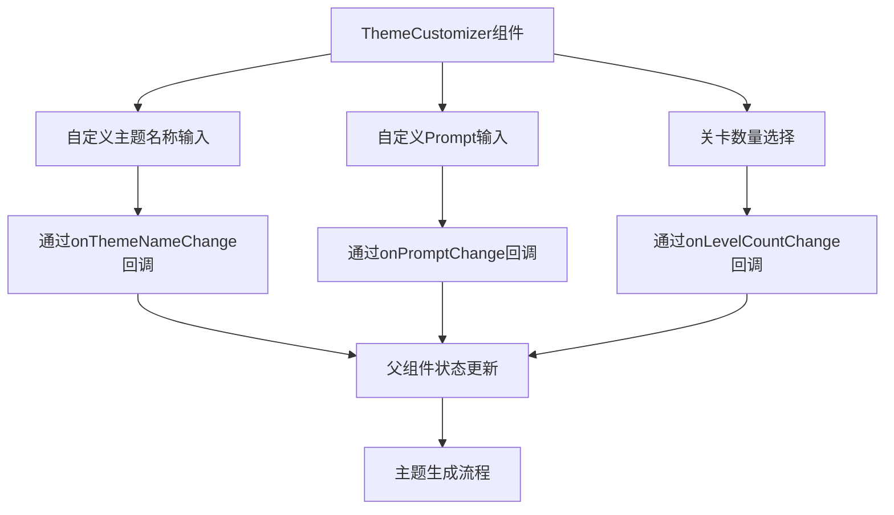
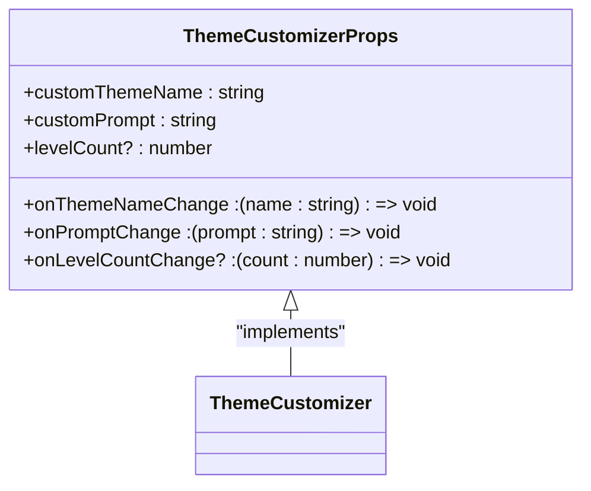
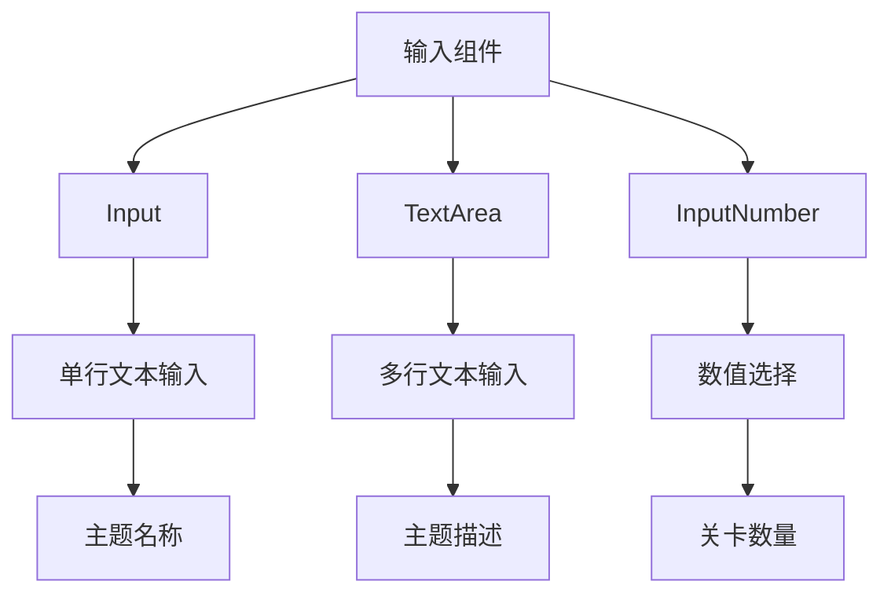
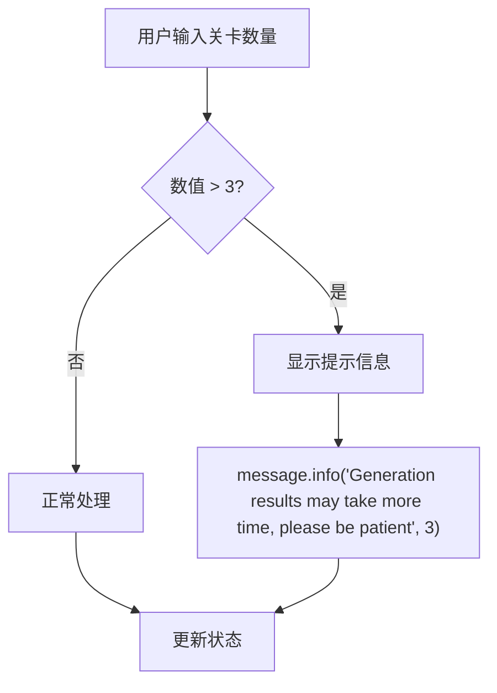
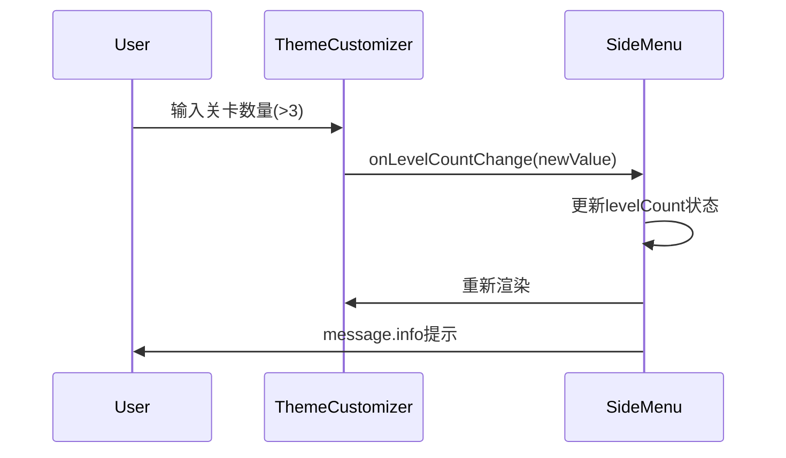

# ThemeCustomizer组件

<cite>
**Referenced Files in This Document**   
- [ThemeCustomizer.tsx](file://components/ui/ThemeCustomizer.tsx)
- [index.ts](file://types/index.ts)
- [SideMenu.tsx](file://components/SideMenu.tsx)
</cite>

## 目录
1. [简介](#简介)
2. [核心功能](#核心功能)
3. [Props参数说明](#props参数说明)
4. [输入组件详解](#输入组件详解)
5. [特殊逻辑与用户反馈](#特殊逻辑与用户反馈)
6. [状态管理集成](#状态管理集成)
7. [表单验证规则](#表单验证规则)
8. [响应式设计](#响应式设计)
9. [错误处理策略](#错误处理策略)
10. [使用示例](#使用示例)

## 简介

ThemeCustomizer组件是一个用于收集用户自定义主题信息的UI组件，它为用户提供了一个直观的界面来创建和配置游戏主题。该组件包含三个主要输入区域：自定义主题名称、自定义Prompt（提示词）和关卡数量选择。通过这个组件，用户可以完全自定义游戏的主题内容，包括主题名称、详细描述和生成的关卡数量。

该组件采用React函数式组件实现，使用Ant Design的UI组件库提供一致的视觉体验。组件设计注重用户体验，提供了清晰的标签、占位符文本和实时反馈机制，确保用户能够轻松地创建符合预期的游戏主题。

**Section sources**
- [ThemeCustomizer.tsx](file://components/ui/ThemeCustomizer.tsx#L1-L68)

## 核心功能

ThemeCustomizer组件的核心功能是收集用户自定义主题的相关信息，为后续的主题生成流程提供必要的输入数据。组件通过三个独立的输入区域分别收集不同类型的用户输入：

1. **自定义主题名称**：允许用户为他们的主题指定一个独特的名称，便于识别和管理。
2. **自定义Prompt**：提供一个文本区域，让用户详细描述他们期望的主题内容，包括风格、元素和氛围等。
3. **关卡数量**：通过数值选择器，让用户指定希望生成的关卡数量，控制游戏的长度和复杂度。

这些输入数据将通过回调函数传递给父组件，用于触发主题生成流程。组件的设计遵循单一职责原则，专注于数据收集和用户交互，而不涉及数据处理或API调用等复杂逻辑。

**Diagram sources**
- [ThemeCustomizer.tsx](file://components/ui/ThemeCustomizer.tsx#L8-L66)

**Section sources**
- [ThemeCustomizer.tsx](file://components/ui/ThemeCustomizer.tsx#L1-L68)

## Props参数说明

ThemeCustomizer组件通过Props接收外部传入的配置和回调函数，实现了灵活的数据绑定和事件处理机制。以下是组件支持的所有Props参数及其详细说明：

| 参数名称 | 类型 | 是否必需 | 默认值 | 描述 |
|--------|------|--------|-------|------|
| customThemeName | string | 是 | 无 | 当前的主题名称，用于Input组件的value属性，实现受控组件模式 |
| onThemeNameChange | (name: string) => void | 是 | 无 | 主题名称变更时的回调函数，接收新的主题名称作为参数 |
| customPrompt | string | 是 | 无 | 当前的提示词内容，用于TextArea组件的value属性，实现受控组件模式 |
| onPromptChange | (prompt: string) => void | 是 | 无 | 提示词内容变更时的回调函数，接收新的提示词作为参数 |
| levelCount | number | 否 | 1 | 当前选择的关卡数量，用于InputNumber组件的value属性 |
| onLevelCountChange | (count: number) => void | 否 | 无 | 关卡数量变更时的回调函数，接收新的关卡数量作为参数 |

这些Props参数的设计遵循了React的最佳实践，通过受控组件模式确保了组件状态的可预测性和可维护性。所有输入字段都通过value属性与外部状态绑定，并通过onChange事件的回调函数将用户输入同步回父组件。

**Diagram sources**
- [index.ts](file://types/index.ts#L56-L63)

**Section sources**
- [index.ts](file://types/index.ts#L56-L63)

## 输入组件详解

ThemeCustomizer组件使用了三种不同的Ant Design输入组件来满足不同类型的数据收集需求，每种组件都针对其特定用途进行了优化配置。

### 自定义主题名称输入

自定义主题名称使用`Input`组件实现，这是一个单行文本输入框，适合收集简短的文本信息。组件配置了以下属性：

- **value**: 绑定到`customThemeName`Props，实现受控组件模式
- **onChange**: 事件处理函数，提取输入框的值并调用`onThemeNameChange`回调
- **placeholder**: 提供"Enter custom theme name"的占位符文本，指导用户输入
- **style**: 设置宽度为100%，确保输入框充分利用容器空间

该输入框用于收集主题的名称，通常是一个简短的标识符，便于用户识别和管理不同的主题。

### 自定义Prompt输入

自定义Prompt使用`TextArea`组件实现，这是一个多行文本输入区域，适合收集较长的描述性文本。组件配置了以下属性：

- **value**: 绑定到`customPrompt`Props，实现受控组件模式
- **onChange**: 事件处理函数，提取文本区域的值并调用`onPromptChange`回调
- **placeholder**: 提供"Enter custom theme description"的占位符文本，指导用户输入详细的主题描述
- **rows**: 设置为4，提供足够的初始可见行数
- **style**: 设置宽度为100%，确保文本区域充分利用容器空间

该文本区域允许用户详细描述他们期望的主题内容，包括艺术风格、场景元素、氛围和特定要求等，为AI生成提供丰富的上下文信息。

### 关卡数量选择

关卡数量使用`InputNumber`组件实现，这是一个数值选择器，专门用于处理数字输入。组件配置了以下属性：

- **value**: 绑定到`levelCount`Props，实现受控组件模式
- **onChange**: 事件处理函数，接收新的数值并调用`onLevelCountChange`回调
- **min**: 设置为1，确保用户至少选择一个关卡
- **max**: 设置为10，限制最大关卡数量，防止过度消耗资源
- **placeholder**: 提供"Number of levels"的占位符文本
- **style**: 设置宽度为100%，确保选择器充分利用容器空间

该数值选择器还包含一个辅助文本，说明"Generate 1-10 levels (default: 1)"，为用户提供清晰的使用指导。

**Section sources**
- [ThemeCustomizer.tsx](file://components/ui/ThemeCustomizer.tsx#L8-L66)

## 特殊逻辑与用户反馈

ThemeCustomizer组件包含一个重要的特殊逻辑，即当用户选择的关卡数量超过3个时，系统会自动显示一个提示信息，告知用户生成过程可能需要更长的时间。这一设计体现了对用户体验的细致考虑，通过提前管理用户期望来提升整体满意度。

该逻辑在`InputNumber`组件的`onChange`事件处理函数中实现，具体流程如下：

1. 接收用户输入的新数值
2. 如果输入值为空，则默认设置为1
3. 调用`onLevelCountChange`回调函数更新父组件状态
4. 检查新数值是否大于3
5. 如果大于3，则使用`message.info`显示提示信息

这种用户反馈机制具有以下优点：

- **及时性**：在用户做出选择后立即提供反馈，无需等待生成过程开始
- **非侵入性**：使用信息提示而非模态对话框，不会中断用户的操作流程
- **明确性**：提示信息清晰地说明了可能的延迟原因，帮助用户理解系统行为
- **时间控制**：提示信息显示3秒后自动消失，避免长期占据用户界面

这种设计模式符合现代Web应用的最佳实践，通过微妙但有效的反馈机制提升用户体验。

**Diagram sources**
- [ThemeCustomizer.tsx](file://components/ui/ThemeCustomizer.tsx#L50-L54)

**Section sources**
- [ThemeCustomizer.tsx](file://components/ui/ThemeCustomizer.tsx#L8-L66)

## 状态管理集成

ThemeCustomizer组件通过回调函数与父组件进行状态管理集成，实现了单向数据流的设计模式。这种设计确保了组件的状态变更能够被父组件正确捕获和处理，同时保持了组件的可复用性和可测试性。

在实际应用中，ThemeCustomizer组件通常与`SideMenu`组件集成使用，后者负责管理更复杂的应用状态。`SideMenu`组件通过useState Hook管理本地状态，包括`customThemeName`、`customPrompt`和`levelCount`等变量，并将这些状态作为Props传递给ThemeCustomizer组件。

当用户在ThemeCustomizer中进行输入时，相应的回调函数会被触发，更新`SideMenu`组件中的状态。这种状态管理方式具有以下特点：

- **集中式管理**：所有状态变更都在父组件中处理，便于调试和维护
- **可预测性**：状态变更通过明确的回调函数触发，避免了隐式的状态修改
- **可扩展性**：父组件可以根据状态变更执行额外的逻辑，如表单验证或API调用

**Diagram sources**
- [SideMenu.tsx](file://components/SideMenu.tsx#L61-L88)
- [ThemeCustomizer.tsx](file://components/ui/ThemeCustomizer.tsx#L8-L66)

**Section sources**
- [SideMenu.tsx](file://components/SideMenu.tsx#L1-L297)

## 表单验证规则

虽然ThemeCustomizer组件本身不直接包含表单验证逻辑，但它为上层组件实现验证提供了必要的基础。实际的表单验证通常在使用ThemeCustomizer的父组件（如`SideMenu`）中实现，利用ThemeCustomizer提供的状态和回调函数进行验证。

典型的验证规则包括：

1. **必填验证**：当用户开始输入自定义主题信息时，两个字段都必须填写
2. **长度验证**：限制主题名称和描述的字符长度，防止过长的输入
3. **数值范围验证**：确保关卡数量在1-10的有效范围内

在`SideMenu`组件中，验证逻辑通过检查`customThemeName`和`customPrompt`的状态来实现。如果用户尝试创建自定义主题但未填写必要信息，系统会显示错误消息并阻止主题创建流程。

这种分层验证设计的优势在于：
- **关注点分离**：ThemeCustomizer专注于数据收集，而验证逻辑由更了解业务规则的父组件处理
- **灵活性**：不同的父组件可以根据需要实现不同的验证规则
- **用户体验**：错误反馈可以与整体UI设计保持一致，提供更流畅的用户体验

**Section sources**
- [SideMenu.tsx](file://components/SideMenu.tsx#L61-L88)

## 响应式设计

ThemeCustomizer组件采用了响应式设计原则，确保在不同屏幕尺寸和设备上都能提供良好的用户体验。组件的主要响应式特性包括：

- **流式布局**：所有输入组件的宽度都设置为100%，能够根据容器大小自动调整
- **垂直排列**：三个输入区域采用垂直堆叠布局，适合移动设备的窄屏幕
- **适当的间距**：使用margin和padding属性确保元素之间有足够的空间，避免拥挤
- **可读的字体大小**：标签和辅助文本使用合适的字体大小，确保在各种设备上都易于阅读

组件的样式通过内联style属性实现，虽然这种方式不如CSS模块化，但在简单组件中提供了足够的灵活性。所有尺寸单位都使用像素或百分比，确保在不同DPI的设备上都能正确显示。

这种响应式设计使得ThemeCustomizer组件能够在桌面、平板和手机等不同设备上无缝工作，为用户提供一致的交互体验。

**Section sources**
- [ThemeCustomizer.tsx](file://components/ui/ThemeCustomizer.tsx#L8-L66)

## 错误处理策略

ThemeCustomizer组件的错误处理策略主要体现在两个层面：组件内部的健壮性和与父组件的协作。

在组件内部，通过以下方式确保健壮性：
- **空值处理**：在`InputNumber`的onChange处理函数中，对空值进行默认处理（设置为1）
- **可选回调**：`onLevelCountChange`回调使用可选链操作符（?.），避免在未提供回调时出现错误
- **边界检查**：通过min和max属性限制输入范围，防止无效数值

与父组件的协作方面，ThemeCustomizer遵循"只负责收集，不负责处理"的原则。当出现验证错误或生成失败时，这些错误的处理由父组件（如`SideMenu`）负责，通过`message.error`等方式向用户反馈。

这种分层错误处理策略的优点是：
- **职责清晰**：每个组件只处理自己范围内的错误
- **用户体验一致**：错误反馈由更了解上下文的父组件统一管理
- **易于维护**：错误处理逻辑集中，便于修改和扩展

**Section sources**
- [ThemeCustomizer.tsx](file://components/ui/ThemeCustomizer.tsx#L8-L66)
- [SideMenu.tsx](file://