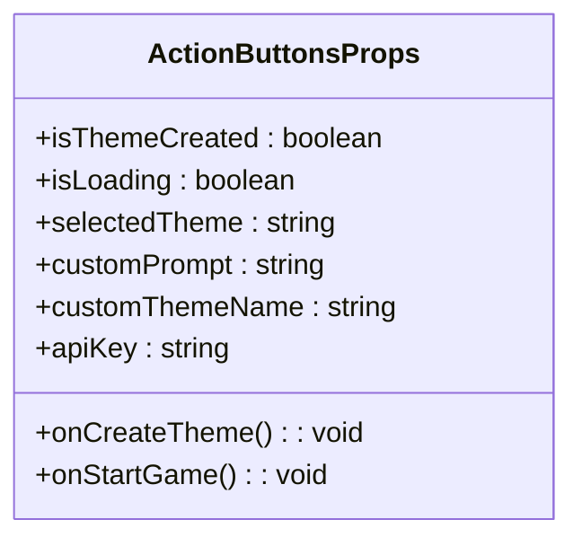
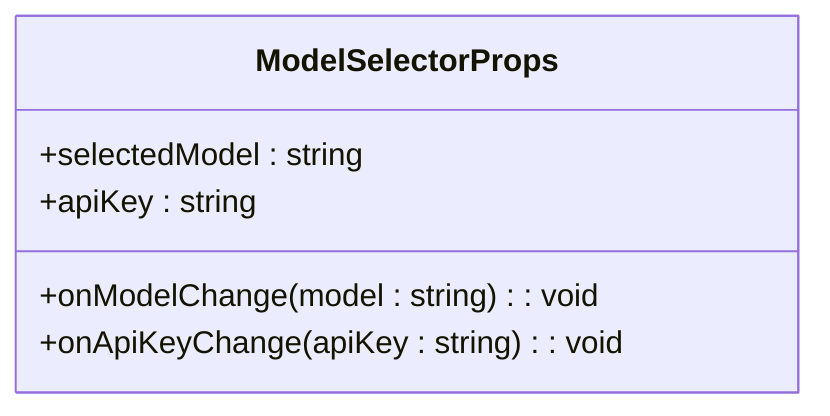
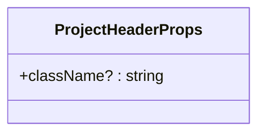
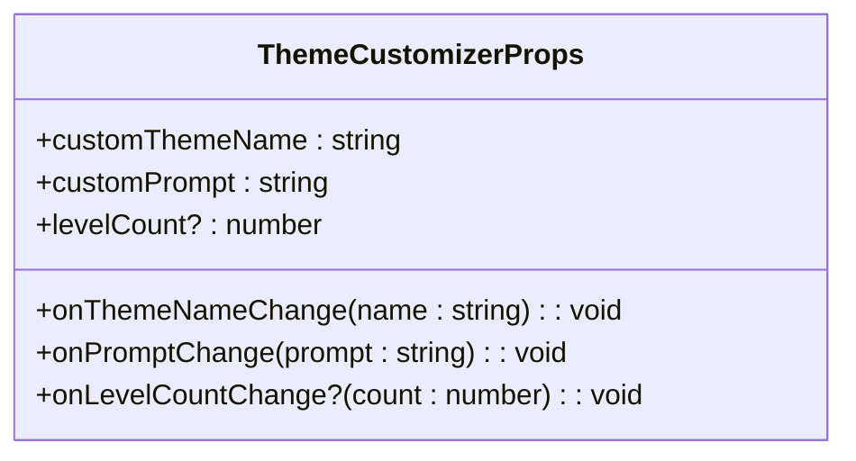
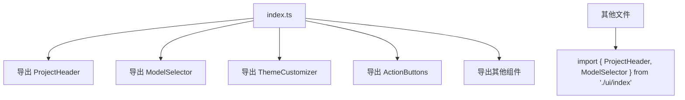
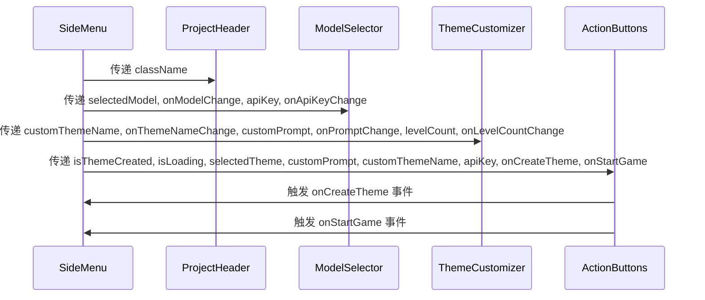
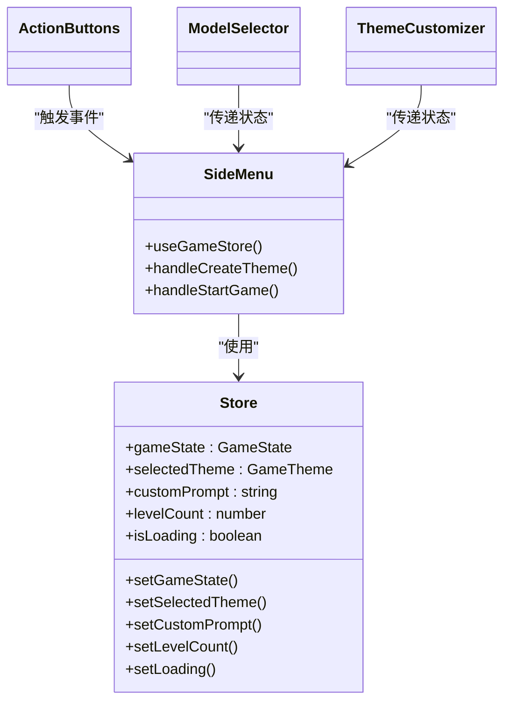

# UI组件

<cite>
**Referenced Files in This Document**   
- [ActionButtons.tsx](file://components/ui/ActionButtons.tsx)
- [ModelSelector.tsx](file://components/ui/ModelSelector.tsx)
- [ProjectHeader.tsx](file://components/ui/ProjectHeader.tsx)
- [ThemeCustomizer.tsx](file://components/ui/ThemeCustomizer.tsx)
- [index.ts](file://components/ui/index.ts)
- [SideMenu.tsx](file://components/SideMenu.tsx)
- [types/index.ts](file://types/index.ts)
- [lib/store.ts](file://lib/store.ts)
</cite>

## 目录
1. [简介](#简介)
2. [核心UI组件](#核心ui组件)
3. [Props接口说明](#props接口说明)
4. [统一导出机制](#统一导出机制)
5. [组件组合与集成](#组件组合与集成)
6. [视觉行为与交互](#视觉行为与交互)
7. [结论](#结论)

## 简介
本文档详细描述了`components/ui`目录下的原子化UI组件及其在应用中的用途。这些组件构成了用户界面的核心构建块，通过组合和集成，形成了完整的用户交互体验。文档将深入分析每个组件的功能、Props接口、使用示例以及它们如何与容器组件协同工作。

## 核心UI组件

### ActionButtons
`ActionButtons`组件提供创建主题和开始游戏的核心操作按钮。它包含两个主要按钮：一个用于创建或重置主题，另一个用于启动游戏。按钮的启用状态根据应用的当前状态（如是否已创建主题、API密钥是否有效等）动态调整。

**Section sources**
- [ActionButtons.tsx](file://components/ui/ActionButtons.tsx#L1-L45)

### ModelSelector
`ModelSelector`组件允许用户选择AI模型并输入API密钥。它提供了模型选择下拉菜单和API密钥输入框，支持用户配置生成模型的参数。当前实现中，仅提供Qwen-Image模型选项。

**Section sources**
- [ModelSelector.tsx](file://components/ui/ModelSelector.tsx#L1-L50)

### ProjectHeader
`ProjectHeader`组件展示项目标题"PIXEL SEED"和动态的循环文本。它使用`ScrambledText`和`CurvedLoop`等子组件创建视觉吸引力，增强用户体验。该组件通常作为应用的顶部标题区域。

**Section sources**
- [ProjectHeader.tsx](file://components/ui/ProjectHeader.tsx#L1-L36)

### ThemeCustomizer
`ThemeCustomizer`组件用于输入自定义主题名称、提示词和关卡数量。它提供表单输入控件，允许用户完全自定义游戏主题。当用户输入超过3个关卡时，会显示提示信息，告知生成时间可能较长。

**Section sources**
- [ThemeCustomizer.tsx](file://components/ui/ThemeCustomizer.tsx#L1-L69)

## Props接口说明

### ActionButtonsProps
定义`ActionButtons`组件的输入属性。

**Diagram sources**
- [types/index.ts](file://types/index.ts#L66-L75)

### ModelSelectorProps
定义`ModelSelector`组件的输入属性。

**Diagram sources**
- [types/index.ts](file://types/index.ts#L48-L53)

### ProjectHeaderProps
定义`ProjectHeader`组件的输入属性。

**Diagram sources**
- [types/index.ts](file://types/index.ts#L43-L45)

### ThemeCustomizerProps
定义`ThemeCustomizer`组件的输入属性。

**Diagram sources**
- [types/index.ts](file://types/index.ts#L56-L63)

## 统一导出机制

`index.ts`文件实现了UI组件的统一导出，简化了组件的导入过程。通过集中导出所有UI组件，开发者可以在其他文件中通过单一导入路径访问所有组件，提高了代码的可维护性和可读性。

**Diagram sources**
- [components/ui/index.ts](file://components/ui/index.ts#L1-L19)

**Section sources**
- [components/ui/index.ts](file://components/ui/index.ts#L1-L19)

## 组件组合与集成

### 与SideMenu的集成
UI组件通过`SideMenu`容器组件进行组合，形成完整的侧边栏界面。`SideMenu`负责管理组件间的状态传递和事件处理，将原子化UI组件整合为功能完整的用户界面。

**Diagram sources**
- [SideMenu.tsx](file://components/SideMenu.tsx#L1-L298)

**Section sources**
- [SideMenu.tsx](file://components/SideMenu.tsx#L1-L298)

### 状态管理集成
UI组件与`lib/store.ts`中的全局状态管理器集成，通过`useGameStore`钩子访问和更新应用状态。这种架构实现了组件间的解耦，确保状态的一致性和可预测性。

**Diagram sources**
- [lib/store.ts](file://lib/store.ts#L1-L313)
- [SideMenu.tsx](file://components/SideMenu.tsx#L1-L298)

## 视觉行为与交互

### 动态效果
`ProjectHeader`组件集成了多种视觉效果：
- `ScrambledText`：当鼠标悬停时，文本字符会动态重组
- `CurvedLoop`：循环滚动的文本，支持鼠标交互控制滚动速度和方向

这些效果通过GSAP动画库实现，提供了流畅的用户交互体验。

**Section sources**
- [components/ui/ScrambleText/index.tsx](file://components/ui/ScrambleText/index.tsx#L1-L87)
- [components/ui/CurvedLoop/index.tsx](file://components/ui/CurvedLoop/index.tsx#L1-L174)

### 交互反馈
组件提供了丰富的交互反馈机制：
- `ActionButtons`根据应用状态动态启用/禁用按钮
- `ThemeCustomizer`在用户输入超过3个关卡时显示提示信息
- `ModelSelector`提供直观的模型选择界面

这些设计确保了用户能够清晰地理解应用状态和操作结果。

## 结论
`components/ui`目录下的原子化组件通过清晰的职责划分和统一的导出机制，构建了可复用、可维护的UI系统。这些组件与`SideMenu`等容器组件和全局状态管理器集成，形成了功能完整、交互丰富的用户界面。通过遵循这一架构模式，应用实现了良好的可扩展性和可维护性。