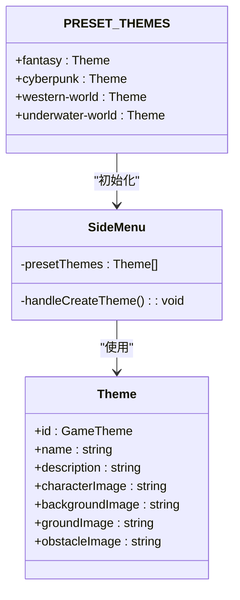
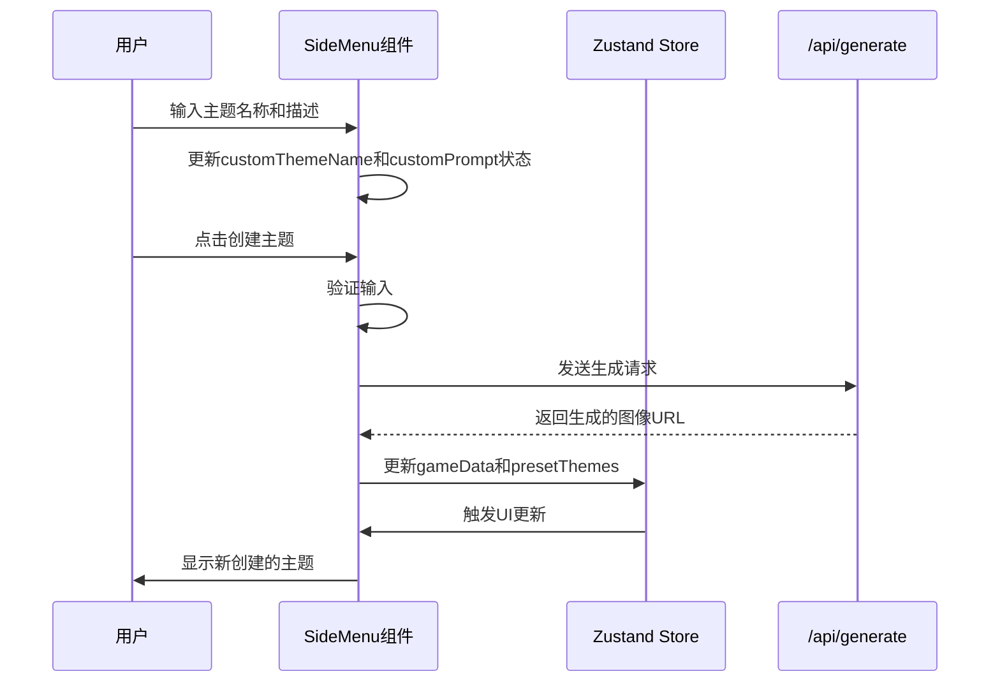
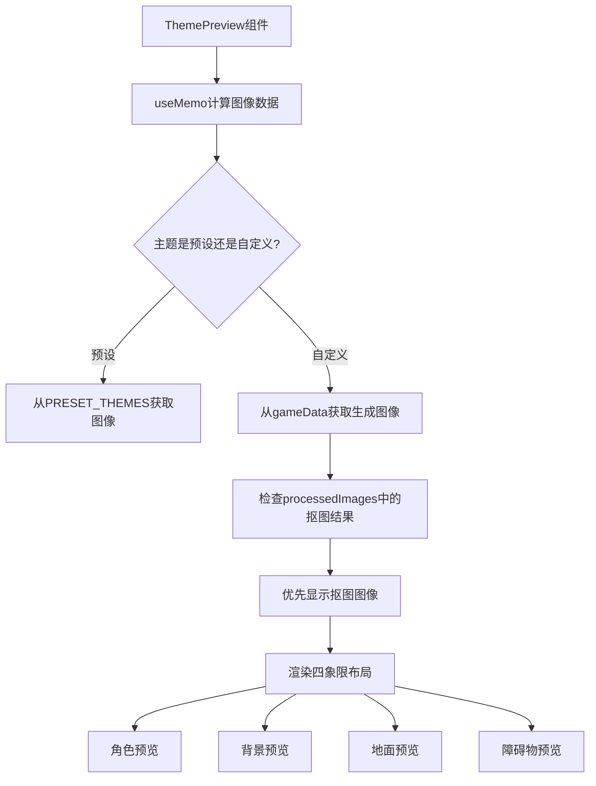

# 主题系统

<cite>
**Referenced Files in This Document**   
- [configs/index.ts](file://configs/index.ts)
- [components/SideMenu.tsx](file://components/SideMenu.tsx)
- [lib/store.ts](file://lib/store.ts)
- [components/ThemePreview.tsx](file://components/ThemePreview.tsx)
- [types/index.ts](file://types/index.ts)
- [app/page.tsx](file://app/page.tsx)
</cite>

## 目录
1. [预设主题实现机制](#预设主题实现机制)
2. [自定义主题创建流程](#自定义主题创建流程)
3. [主题预览与四象限布局](#主题预览与四象限布局)
4. [主题删除权限控制](#主题删除权限控制)
5. [数据结构与组件交互](#数据结构与组件交互)

## 预设主题实现机制

预设主题通过 `PRESET_THEMES` 常量在 `configs/index.ts` 文件中定义，该常量导出一个包含多个主题对象的数组。每个主题对象都实现了 `Theme` 接口，包含 `id`、`name`、`description` 以及四种图像资源的 URL（角色、背景、地面、障碍物）。这些预设主题如史诗魔幻（Fantasy）、赛博朋克（Cyberpunk）等，其配置信息在应用初始化时被加载到状态管理中。

在 `SideMenu.tsx` 组件中，通过导入 `PRESET_THEMES` 并使用 `useState` 初始化 `presetThemes` 状态，实现了预设主题的渲染。当用户选择一个预设主题时，`handleCreateTheme` 函数会根据选中的主题 ID 查找对应的配置信息，并将其用于图像生成请求。主题的渲染通过 `ThemesList` 组件完成，该组件接收 `themes` 数组作为属性，并为每个主题创建一个可点击的卡片，显示主题名称、描述和背景预览图。

**Diagram sources**
- [configs/index.ts](file://configs/index.ts#L29-L66)
- [components/SideMenu.tsx](file://components/SideMenu.tsx#L33-L295)

**Section sources**
- [configs/index.ts](file://configs/index.ts#L29-L66)
- [components/SideMenu.tsx](file://components/SideMenu.tsx#L33-L295)

## 自定义主题创建流程

自定义主题的创建流程始于用户在 `SideMenu` 组件的输入框中输入主题名称和描述。这些输入值通过 `onThemeNameChange` 和 `onPromptChange` 回调函数绑定到 `customThemeName` 和 `customPrompt` 局部状态。当用户点击“创建主题”按钮时，`handleCreateTheme` 函数被触发。

该函数首先验证用户输入，确保主题名称和描述均不为空。验证通过后，函数会构造一个包含用户输入信息的请求体，并调用 `generateImages` 函数向 `/api/generate` 端点发起 POST 请求。生成的图像数据（包括角色、背景、地面和障碍物）被存储在全局状态 `gameData` 中。随后，一个新的自定义主题对象被创建，其 ID 以 `custom-` 为前缀，并包含生成的图像 URL。这个新主题被添加到 `presetThemes` 数组中，并通过 `setPresetThemes` 更新状态，最终在 UI 上呈现。

**Diagram sources**
- [components/SideMenu.tsx](file://components/SideMenu.tsx#L33-L295)
- [lib/store.ts](file://lib/store.ts#L129-L312)

**Section sources**
- [components/SideMenu.tsx](file://components/SideMenu.tsx#L33-L295)
- [lib/store.ts](file://lib/store.ts#L129-L312)

## 主题预览与四象限布局

`ThemePreview.tsx` 组件负责实现主题的四象限布局预览。该组件通过 `useMemo` 钩子计算当前应显示的图像数据，它会根据 `selectedTheme` 的值判断是显示预设主题的静态图片还是从 `gameData` 中提取的动态生成图片。对于自定义主题，它优先显示经过抠图处理的图像（存储在 `processedImages` 中），若无处理结果则显示原始生成图像。

组件的 UI 布局分为四个独立的区域，分别对应角色、关卡背景、地面纹理和障碍物。每个区域都包含一个 `ImagePreview` 子组件，该组件封装了图像显示、加载状态指示和操作按钮（如“抠图”和“重新生成”）。`ImagePreview` 组件通过 `previewImages` 对象接收图像 URL，并根据 `regeneratingImages` 和 `processingImages` 状态显示相应的加载动画。用户可以独立地为每个图像元素触发重新生成或抠图操作，实现了高度的交互灵活性。

**Diagram sources**
- [components/ThemePreview.tsx](file://components/ThemePreview.tsx#L191-L543)

**Section sources**
- [components/ThemePreview.tsx](file://components/ThemePreview.tsx#L191-L543)

## 主题删除权限控制

主题删除功能的权限控制逻辑在 `app/page.tsx` 文件中的 `handleDeleteTheme` 函数内实现。该函数接收一个 `themeId` 参数，并首先检查该 ID 是否以 `custom-` 为前缀。只有 ID 以 `custom-` 开头的主题才被视为自定义主题，允许被删除。如果尝试删除预设主题（如 `fantasy` 或 `cyberpunk`），系统会通过 `message.error` 显示错误提示“只能删除自定义主题”，并终止删除操作。

当删除操作被允许时，函数会使用 `filter` 方法从 `presetThemes` 数组中移除指定 ID 的主题，然后调用 `saveThemesToStorage` 将更新后的主题列表持久化到 `localStorage`。此外，如果被删除的主题是当前选中的主题，系统会自动将 `selectedTheme