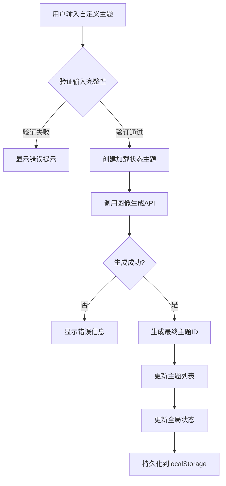
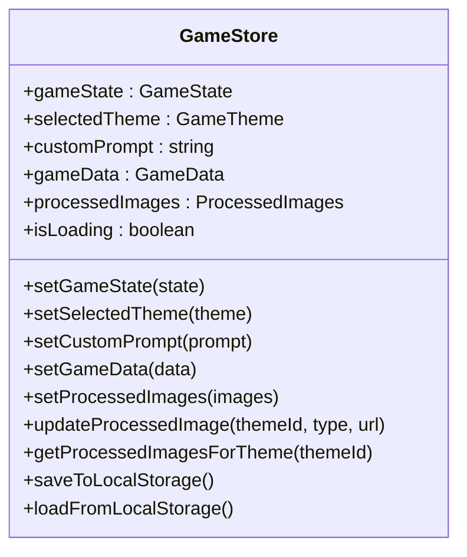
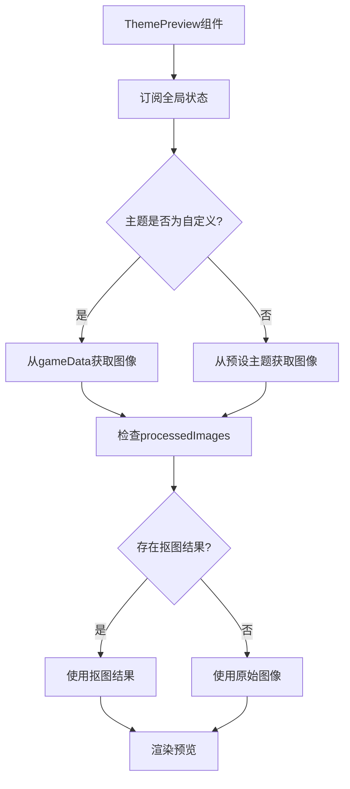
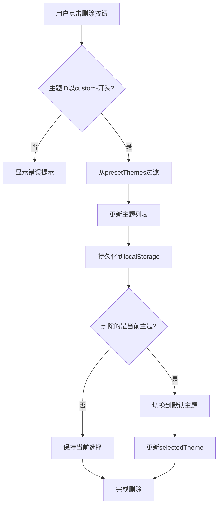
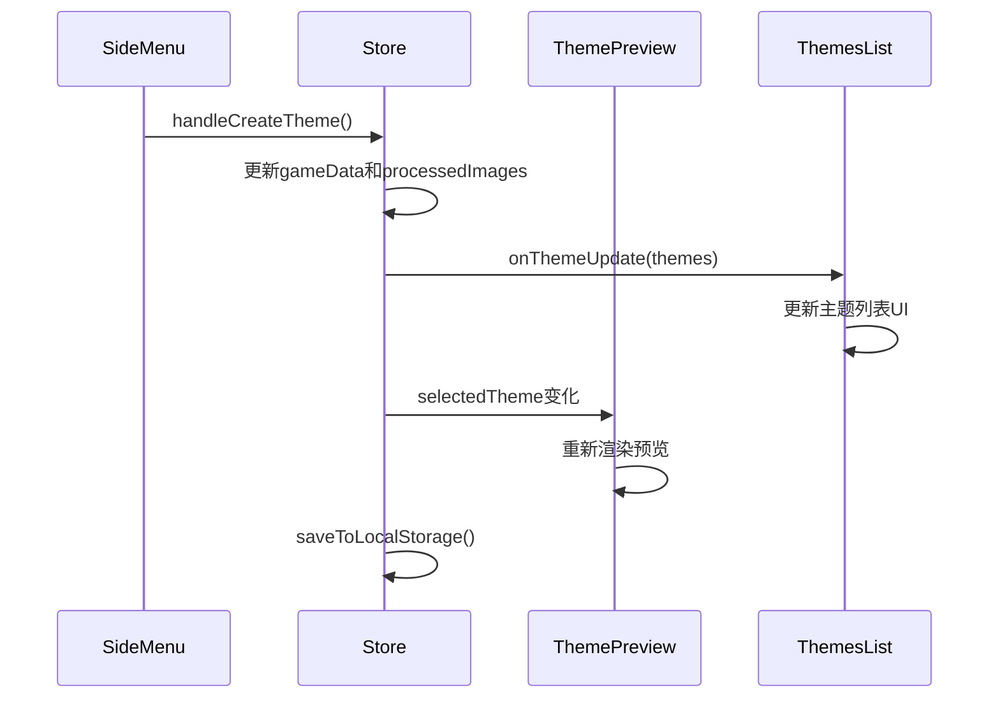

# 自定义主题

<cite>
**本文档引用的文件**
- [SideMenu.tsx](file://components/SideMenu.tsx)
- [store.ts](file://lib/store.ts)
- [ThemePreview.tsx](file://components/ThemePreview.tsx)
- [page.tsx](file://app/page.tsx)
- [types/index.ts](file://types/index.ts)
</cite>

## 目录
1. [简介](#简介)
2. [自定义主题创建流程](#自定义主题创建流程)
3. [状态管理与持久化](#状态管理与持久化)
4. [主题预览与动态渲染](#主题预览与动态渲染)
5. [主题删除功能实现](#主题删除功能实现)
6. [组件间状态同步机制](#组件间状态同步机制)
7. [结论](#结论)

## 简介
本文档详细阐述了像素种子游戏中的自定义主题创建与管理流程。系统通过Zustand状态管理库实现全局状态管理，并利用localStorage进行数据持久化。用户可以在侧边菜单中输入自定义提示词，系统将生成相应的游戏主题，并在预览界面中动态展示四象限内容。文档涵盖了从用户输入到数据存储的完整流程，包括状态管理、UI更新、数据持久化和主题删除等核心功能。

**Section sources**
- [SideMenu.tsx](file://components/SideMenu.tsx#L1-L297)
- [store.ts](file://lib/store.ts#L1-L312)

## 自定义主题创建流程
自定义主题的创建始于`SideMenu.tsx`组件中的用户输入。当用户填写自定义主题名称和描述后，点击"Create Theme"按钮触发`handleCreateTheme`函数。该函数首先验证输入的完整性，然后构建包含主题信息的请求体，并调用图像生成API。

在创建过程中，系统会临时创建一个以`loading-`为前缀的主题ID，用于显示加载状态。一旦图像生成完成，系统将生成以`custom-`为前缀的最终主题ID，并更新主题列表。整个流程确保了用户体验的流畅性，通过加载提示和进度反馈让用户了解生成状态。

**Diagram sources**
- [SideMenu.tsx](file://components/SideMenu.tsx#L72-L237)
- [store.ts](file://lib/store.ts#L129-L312)

**Section sources**
- [SideMenu.tsx](file://components/SideMenu.tsx#L72-L237)
- [store.ts](file://lib/store.ts#L129-L312)

## 状态管理与持久化
系统使用Zustand库在`lib/store.ts`中创建全局状态管理器`useGameStore`。该store定义了游戏状态、主题信息、生成参数和处理后的图像等核心状态。关键状态包括`selectedTheme`、`customPrompt`、`gameData`和`processedImages`。

状态持久化通过`saveToLocalStorage`和`loadFromLocalStorage`方法实现。每当主题选择或自定义提示发生变化时，`setSelectedTheme`和`setCustomPrompt`方法会自动调用`saveToLocalStorage`，将相关状态保存到浏览器的localStorage中。应用加载时，`loadFromLocalStorage`方法会恢复之前保存的状态，确保用户数据的连续性。

**Diagram sources**
- [store.ts](file://lib/store.ts#L129-L312)

**Section sources**
- [store.ts](file://lib/store.ts#L129-L312)

## 主题预览与动态渲染
`ThemePreview.tsx`组件负责根据store中的自定义主题数据动态渲染四象限预览图。组件通过`useGameStore`钩子订阅全局状态，当`selectedTheme`或`gameData`发生变化时自动重新渲染。

预览界面分为四个主要部分：角色形象、关卡背景、地面纹理和障碍物。每个部分都实现了独立的重新生成功能，用户可以单独重新生成特定元素。组件使用`useMemo`优化性能，仅在相关依赖项变化时重新计算图像数据。

**Diagram sources**
- [ThemePreview.tsx](file://components/ThemePreview.tsx#L191-L543)
- [store.ts](file://lib/store.ts#L129-L312)

**Section sources**
- [ThemePreview.tsx](file://components/ThemePreview.tsx#L191-L543)
- [store.ts](file://lib/store.ts#L129-L312)

## 主题删除功能实现
主题删除功能通过`handleDeleteTheme`函数实现，该函数位于`app/page.tsx`中。系统严格限制删除操作，仅允许删除以`custom-`前缀的主题，防止用户误删预设主题。

删除逻辑包括：验证主题ID前缀、从主题列表中过滤掉目标主题、更新状态并持久化到localStorage。如果被删除的主题是当前选中的主题，系统会自动切换到默认的"fantasy"主题，确保应用状态的完整性。

**Diagram sources**
- [page.tsx](file://app/page.tsx#L120-L137)
- [store.ts](file://lib/store.ts#L129-L312)

**Section sources**
- [page.tsx](file://app/page.tsx#L120-L137)
- [store.ts](file://lib/store.ts#L129-L312)

## 组件间状态同步机制
系统通过Zustand store实现了组件间的高效状态同步。`SideMenu`、`ThemePreview`和`ThemesList`等组件都通过`useGameStore`钩子访问和更新共享状态，确保UI的一致性。

当用户在`SideMenu`中创建新主题时，`onThemeUpdate`回调会通知`ThemesList`更新主题列表。同时，`ThemePreview`组件会监听`selectedTheme`和`gameData`的变化，自动更新预览内容。这种基于状态的响应式设计模式，使得组件间的通信简洁高效。

**Diagram sources**
- [SideMenu.tsx](file://components/SideMenu.tsx#L33-L295)
- [ThemePreview.tsx](file://components/ThemePreview.tsx#L191-L543)
- [page.tsx](file://app/page.tsx#L1-L243)

**Section sources**
- [SideMenu.tsx](file://components/SideMenu.tsx#L33-L295)
- [ThemePreview.tsx](file://components/ThemePreview.tsx#L191-L543)
- [page.tsx](file://app/page.tsx#L1-L243)

## 结论
本文档详细阐述了自定义主题的创建与管理流程。系统通过Zustand实现高效的状态管理，利用localStorage确保数据持久化。`SideMenu`组件处理用户输入和主题创建，`ThemePreview`组件实现动态渲染和独立重新生成，而删除功能则通过严格的前缀验证保护预设主题。组件间通过共享状态实现无缝同步，为用户提供流畅的主题定制体验。整体设计体现了清晰的职责分离和高效的响应式编程模式。