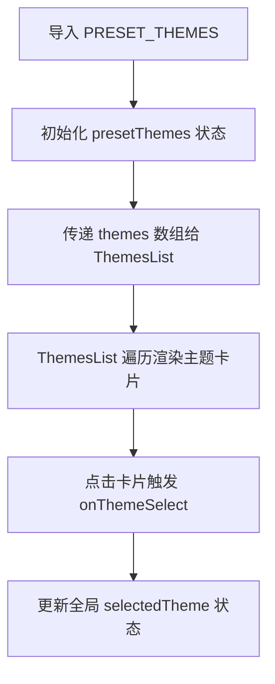
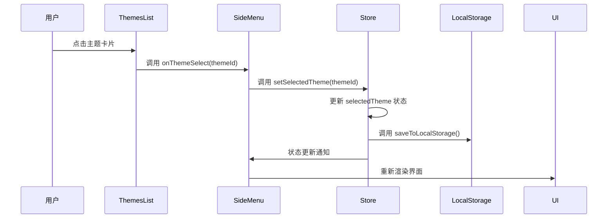

# 预设主题

<cite>
**本文档中引用的文件**  
- [index.ts](file://configs/index.ts)
- [SideMenu.tsx](file://components/SideMenu.tsx)
- [store.ts](file://lib/store.ts)
- [index.ts](file://types/index.ts)
- [ThemesList.tsx](file://components/ThemesList.tsx)
- [page.tsx](file://app/page.tsx)
</cite>

## 目录
1. [简介](#简介)
2. [预设主题数据结构](#预设主题数据结构)
3. [UI组件中的主题渲染机制](#ui组件中的主题渲染机制)
4. [主题切换流程与状态管理](#主题切换流程与状态管理)
5. [国际化支持与扩展性](#国际化支持与扩展性)

## 简介
本项目提供了一套完整的预设主题系统，用于构建2D横版像素风游戏的视觉风格。系统通过定义多个预设主题，每个主题包含角色、背景、地面和障碍物四类图像资源，用户可选择主题以快速生成符合特定美学风格的游戏场景。主题数据在应用启动时加载，并通过Zustand状态管理库实现全局状态同步。用户选择主题后，系统将更新当前主题状态并触发UI重渲染，确保游戏界面与所选主题保持一致。

## 预设主题数据结构
预设主题在`configs/index.ts`文件中通过`PRESET_THEMES`常量定义，其数据结构遵循`Theme`接口规范，包含主题ID、名称、描述及四类图像URL。

```typescript
export interface Theme {
  id: GameTheme
  name: string
  description: string
  characterImage: string
  backgroundImage: string
  groundImage: string
  obstacleImage: string
  isLoading?: boolean
}
```

每个主题对象包含以下字段：
- `id`：主题唯一标识符，类型为`GameTheme`，目前支持`fantasy`、`cyberpunk`、`western-world`、`underwater-world`四种预设值
- `name`：主题显示名称，用于UI展示
- `description`：主题描述文本，作为图像生成的提示词（prompt）
- `characterImage`：角色图像的CDN URL
- `backgroundImage`：背景图像的CDN URL
- `groundImage`：地面图像的CDN URL
- `obstacleImage`：障碍物图像的CDN URL
- `isLoading`：可选布尔值，表示主题是否处于加载状态

当前系统内置四个预设主题：
- **Fantasy**：魔法、龙、城堡和森林构成的奇幻世界
- **Cyberpunk**：霓虹灯、机械和未来城市的赛博朋克世界
- **Western World**：牛仔、酒馆、沙漠景观和边疆小镇的西部世界
- **Underwater World**：珊瑚礁、深海生物和古代水下文明的神秘海底世界

所有图像资源均托管于阿里云CDN，确保快速加载和高可用性。

**Section sources**
- [index.ts](file://configs/index.ts#L29-L66)
- [index.ts](file://types/index.ts#L4-L13)

## UI组件中的主题渲染机制
预设主题在`SideMenu.tsx`中被导入并渲染为可点击的主题卡片列表。主题列表由`ThemesList`组件负责渲染，该组件接收主题数组、当前选中主题和主题选择回调函数作为props。



**Diagram sources**
- [SideMenu.tsx](file://components/SideMenu.tsx#L33-L295)
- [ThemesList.tsx](file://components/ThemesList.tsx#L7-L79)

`SideMenu`组件中通过以下代码初始化主题状态：

```typescript
const [presetThemes, setPresetThemes] = useState(PRESET_THEMES)
```

`ThemesList`组件接收`themes`数组并使用Ant Design的`Card`组件渲染每个主题。每个主题卡片包含：
- 封面图：显示`backgroundImage`，对于自定义主题则显示生成后的背景图
- 标题：显示主题`name`
- 描述：显示主题`description`

用户点击主题卡片时，`onClick`事件触发`onThemeSelect`回调函数，将该主题的`id`传递给父组件。

**Section sources**
- [SideMenu.tsx](file://components/SideMenu.tsx#L33-L295)
- [ThemesList.tsx](file://components/ThemesList.tsx#L7-L79)

## 主题切换流程与状态管理
主题切换流程通过Zustand store实现状态管理。`lib/store.ts`中定义了`useGameStore`，包含`selectedTheme`状态和`setSelectedTheme`方法。



**Diagram sources**
- [store.ts](file://lib/store.ts#L129-L312)
- [SideMenu.tsx](file://components/SideMenu.tsx#L33-L295)

`setSelectedTheme`方法的实现如下：

```typescript
setSelectedTheme: (theme) => {
  set({ selectedTheme: theme })
  get().saveToLocalStorage()
}
```

当用户选择新主题时：
1. `ThemesList`组件调用`onThemeSelect`回调
2. `SideMenu`组件接收到主题ID并调用`setSelectedTheme`
3. Zustand store更新`selectedTheme`状态
4. `saveToLocalStorage`方法将当前主题持久化到`localStorage`
5. 所有订阅该状态的组件（如`ThemePreview`）自动重新渲染

此外，`app/page.tsx`在组件挂载时从`localStorage`加载主题数据，确保页面刷新后能恢复上次选择的主题：

```typescript
useEffect(() => {
  const storedThemes = loadThemesFromStorage()
  setPresetThemes(storedThemes)
  loadFromLocalStorage()
}, [loadFromLocalStorage])
```

**Section sources**
- [store.ts](file://lib/store.ts#L129-L312)
- [page.tsx](file://app/page.tsx#L47-L58)

## 国际化支持与扩展性
当前系统具备良好的扩展性，支持新增预设主题和国际化适配。

### 扩展新预设主题
要添加新的预设主题，只需在`configs/index.ts`的`PRESET_THEMES`数组中添加新的主题对象：

```typescript
{
  id: 'new-theme-id' as GameTheme,
  name: 'New Theme Name',
  description: 'Description for the new theme',
  characterImage: 'https://img.alicdn.com/.../character.png',
  backgroundImage: 'https://img.alicdn.com/.../background.png',
  groundImage: 'https://img.alicdn.com/.../ground.png',
  obstacleImage: 'https://img.alicdn.com/.../obstacle.png',
}
```

同时需要在`GameTheme`类型中添加新的主题ID：

```typescript
export type GameTheme = 'fantasy' | 'cyberpunk' | 'custom' | 'new-theme-id'
```

### 国际化支持
虽然当前主题名称和描述为英文，但系统架构支持国际化。可通过以下方式实现：
1. 创建多语言资源文件（如`locales/zh-CN.json`、`locales/en-US.json`）
2. 将主题的`name`和`description`替换为国际化键名
3. 使用i18n库在运行时根据用户语言环境加载对应翻译

例如：
```typescript
{
  id: 'fantasy',
  name: 'theme.fantasy.name',
  description: 'theme.fantasy.description',
  // ... 其他字段
}
```

然后在UI组件中通过`useTranslation`钩子获取翻译后的文本。

**Section sources**
- [index.ts](file://configs/index.ts#L29-L66)
- [store.ts](file://lib/store.ts#L1-L312)