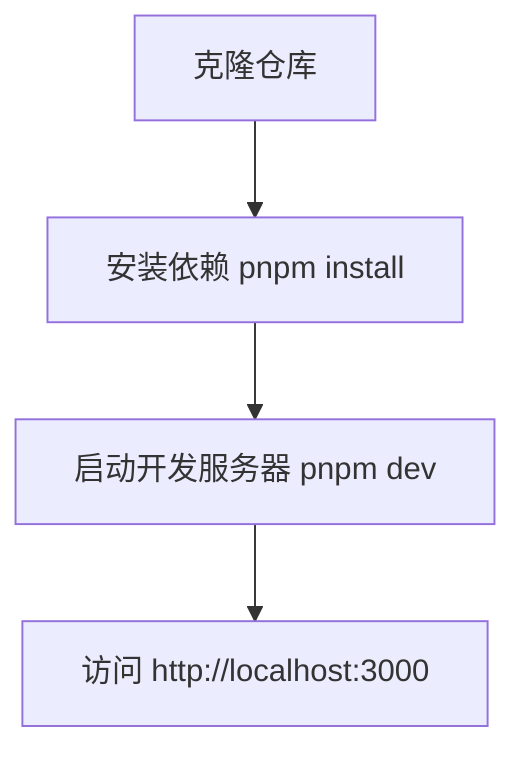

# 快速开始

<cite>
**本文档引用的文件**  
- [README.md](file://README.md)
- [package.json](file://package.json)
- [app/page.tsx](file://app/page.tsx)
</cite>

## 目录
1. [简介](#简介)
2. [环境准备](#环境准备)
3. [项目克隆与依赖安装](#项目克隆与依赖安装)
4. [启动开发服务器](#启动开发服务器)
5. [代码修改与热重载](#代码修改与热重载)
6. [常见问题排查](#常见问题排查)

## 简介

本指南旨在帮助开发者快速搭建并运行 `pixel-seed` 项目。`pixel-seed` 是一个基于 Next.js 框架构建的现代化 Web 应用，利用了 React 19 和 Next.js 15 的最新特性。通过本指南，您将学习如何从零开始配置本地开发环境，并成功启动项目。

**Section sources**
- [README.md](file://README.md#L1-L36)

## 环境准备

在开始之前，请确保您的开发机器上已安装以下基础工具：

- **Node.js**: 推荐使用 v18 或更高版本。您可以通过在终端运行 `node --version` 来检查当前版本。
- **pnpm**: 本项目使用 pnpm 作为包管理器。您可以通过运行 `npm install -g pnpm` 来全局安装 pnpm。

这些工具是运行 Next.js 项目的基础。Node.js 提供了 JavaScript 运行时环境，而 pnpm 则用于高效地管理项目依赖。

## 项目克隆与依赖安装

1.  **克隆项目仓库**:
    打开您的终端，执行以下命令来克隆 `pixel-seed` 项目到本地：
    ```bash
    git clone https://github.com/your-username/pixel-seed.git
    cd pixel-seed
    ```

2.  **安装项目依赖**:
    项目根目录下的 `pnpm-lock.yaml` 文件明确指出了项目使用 pnpm 进行依赖管理。请运行以下命令来安装所有必需的依赖包：
    ```bash
    pnpm install
    ```
    此命令会根据 `package.json` 和 `pnpm-lock.yaml` 文件下载并安装所有依赖项，包括 `next`, `react`, `antd` 等。

**Section sources**
- [package.json](file://package.json#L1-L34)
- [README.md](file://README.md#L3-L10)

## 启动开发服务器

依赖安装完成后，即可启动开发服务器。

1.  **运行开发命令**:
    在项目根目录下，执行以下命令：
    ```bash
    pnpm dev
    ```
    根据 `package.json` 文件中的脚本定义，此命令等同于 `next dev --turbopack`，它将启动一个带有 Turbopack 的开发服务器，提供更快的热重载体验。

2.  **访问应用**:
    服务器成功启动后，您会在终端看到类似 `ready on http://localhost:3000` 的提示。打开您的浏览器，访问 [http://localhost:3000](http://localhost:3000) 即可看到应用的运行界面。



**Diagram sources**
- [package.json](file://package.json#L7-L9)
- [README.md](file://README.md#L5-L10)

**Section sources**
- [README.md](file://README.md#L5-L10)

## 代码修改与热重载

Next.js 提供了强大的热重载（Hot Reloading）功能，极大地提升了开发效率。

1.  **修改页面代码**:
    您可以尝试修改应用的主页面文件 `app/page.tsx`。例如，找到文件中的 `<main className="min-h-screen">` 标签，您可以修改 `className` 或添加新的 HTML 元素。

2.  **实时预览更改**:
    保存对 `app/page.tsx` 文件的修改后，开发服务器会自动检测到文件变化。浏览器中的页面将**无需手动刷新**即可立即更新，显示出您所做的更改。这种即时反馈是 Next.js 热重载特性的核心优势。

**Section sources**
- [app/page.tsx](file://app/page.tsx#L13-L242)
- [README.md](file://README.md#L10-L13)

## 常见问题排查

- **问题：`pnpm` 命令未找到**  
  **解决方案**：请确保您已成功全局安装 pnpm。如果遇到权限问题，可以尝试在命令前加上 `sudo`（macOS/Linux）或以管理员身份运行命令提示符（Windows）。

- **问题：安装依赖时出现错误**  
  **解决方案**：请检查您的网络连接是否正常。有时网络问题会导致依赖下载失败。您可以尝试更换网络环境或使用国内镜像源。

- **问题：开发服务器无法启动或端口被占用**  
  **解决方案**：检查终端输出的错误信息。如果提示端口 3000 被占用，您可以在 `package.json` 的 `dev` 脚本中添加 `-p` 参数来指定其他端口，例如 `next dev --turbopack -p 3001`。

- **问题：页面修改后未实时更新**  
  **解决方案**：首先确认您运行的是 `pnpm dev` 而非 `pnpm build`。其次，检查终端是否报错，任何语法错误都可能导致热重载失败。修复代码错误后，保存文件通常会恢复热重载功能。

**Section sources**
- [README.md](file://README.md#L5-L10)