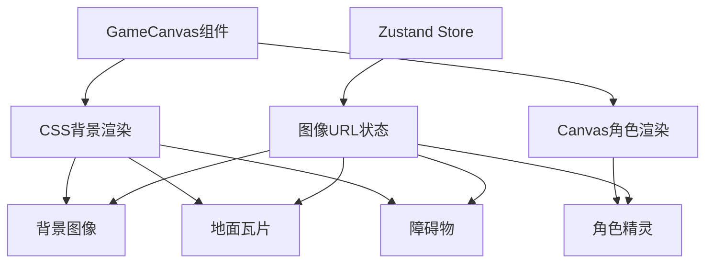
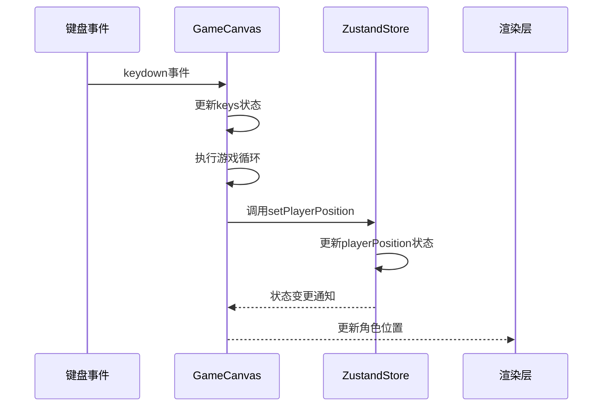
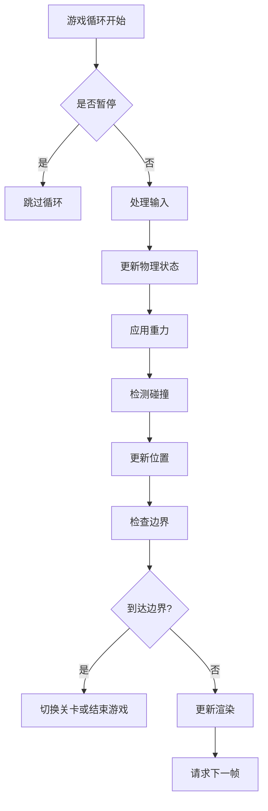
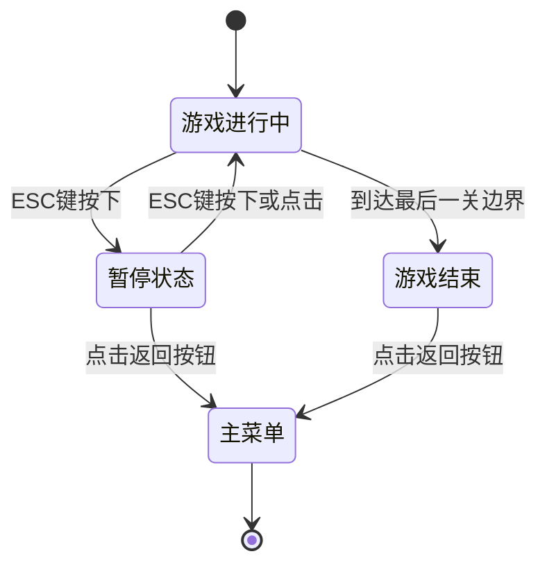

# 游戏玩法系统

<cite>
**Referenced Files in This Document**   
- [GameCanvas.tsx](file://components/GameCanvas.tsx)
- [store.ts](file://lib/store.ts)
</cite>

## 目录
1. [游戏画面渲染机制](#游戏画面渲染机制)
2. [角色控制与状态管理](#角色控制与状态管理)
3. [游戏循环与物理系统](#游戏循环与物理系统)
4. [暂停与菜单交互](#暂停与菜单交互)

## 游戏画面渲染机制

游戏画面采用混合渲染方案，结合CSS背景和Canvas元素实现视觉效果。`GameCanvas.tsx`组件通过CSS的`backgroundImage`属性渲染游戏背景、地面和障碍物，而角色则使用`motion.div`组件进行独立渲染，实现了分层显示。

背景、地面和障碍物的渲染基于Zustand store中的图像URL状态，优先使用抠图处理后的图像。地面系统通过`groundTiles`数组管理多个地面瓦片，支持动态生成和布局。障碍物通过`obstacles`数组管理，每个障碍物都有唯一的ID和位置信息。

**Diagram sources**
- [GameCanvas.tsx](file://components/GameCanvas.tsx#L300-L350)
- [store.ts](file://lib/store.ts#L129-L312)

**Section sources**
- [GameCanvas.tsx](file://components/GameCanvas.tsx#L300-L350)
- [store.ts](file://lib/store.ts#L129-L312)

## 角色控制与状态管理

角色控制通过键盘事件监听实现，支持WASD键和方向键控制移动，空格键控制跳跃。`GameCanvas.tsx`组件使用`useEffect`监听`keydown`和`keyup`事件，将按键状态存储在`keys`状态中。

角色位置由Zustand store中的`playerPosition`状态管理，该状态通过`setPlayerPosition`函数更新。角色的朝向、动作状态等信息通过`character`本地状态管理，并与store中的`currentAction`状态同步。

**Diagram sources**
- [GameCanvas.tsx](file://components/GameCanvas.tsx#L200-L250)
- [store.ts](file://lib/store.ts#L129-L312)

**Section sources**
- [GameCanvas.tsx](file://components/GameCanvas.tsx#L200-L250)
- [store.ts](file://lib/store.ts#L129-L312)

## 游戏循环与物理系统

游戏循环使用`requestAnimationFrame`实现，目标帧率为60fps。循环中处理角色移动、跳跃、重力和碰撞检测等物理逻辑。重力系统通过`velocityY`变量实现，角色跳跃时赋予向上的初速度，随后受重力影响逐渐下落。

碰撞检测系统检查角色与障碍物的碰撞，以及角色是否站在地面或障碍物上。当角色到达关卡边界时，会触发关卡切换或游戏结束逻辑。游戏循环还处理角色动画状态，根据当前动作更新`currentAction`状态。

**Diagram sources**
- [GameCanvas.tsx](file://components/GameCanvas.tsx#L400-L600)
- [store.ts](file://lib/store.ts#L129-L312)

**Section sources**
- [GameCanvas.tsx](file://components/GameCanvas.tsx#L400-L600)
- [store.ts](file://lib/store.ts#L129-L312)

## 暂停与菜单交互

暂停功能通过ESC键触发，调用`setIsPaused`函数切换`isPaused`状态。暂停时游戏循环停止执行，屏幕上显示暂停遮罩，点击遮罩或再次按下ESC键可恢复游戏。

返回主菜单功能通过点击"Back to Menu"按钮触发，调用`handleBackToMenu`函数。该函数会重置游戏状态，调用`resetGame`函数将store恢复到初始状态，并将`gameState`设置为'menu'。

**Diagram sources**
- [GameCanvas.tsx](file://components/GameCanvas.tsx#L650-L750)
- [store.ts](file://lib/store.ts#L129-L312)

**Section sources**
- [GameCanvas.tsx](file://components/GameCanvas.tsx#L650-L750)
- [store.ts](file://lib/store.ts#L129-L312)