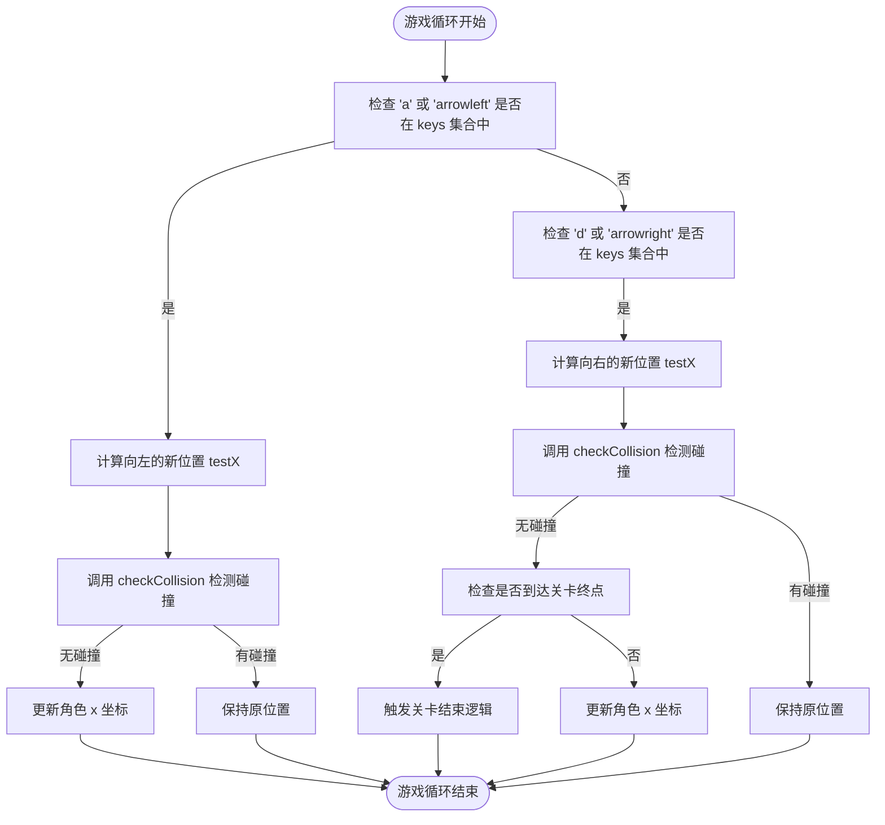
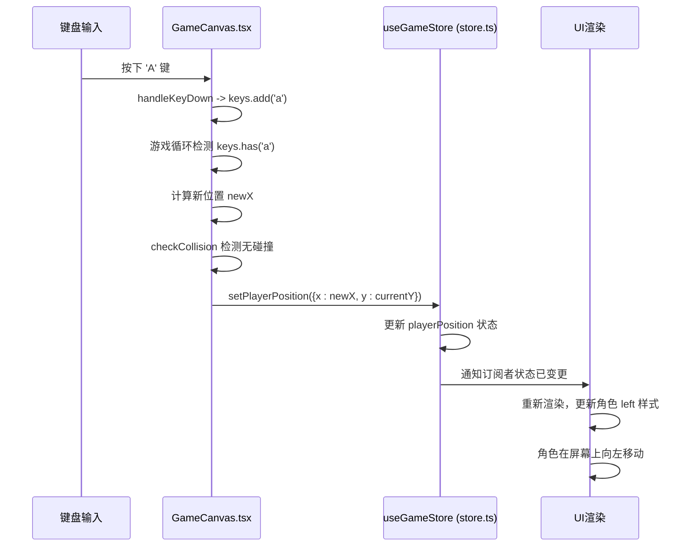

# 角色控制

<cite>
**Referenced Files in This Document**   
- [GameCanvas.tsx](file://components/GameCanvas.tsx)
- [store.ts](file://lib/store.ts)
</cite>

## Table of Contents
1. [键盘事件监听机制](#键盘事件监听机制)
2. [角色移动逻辑与碰撞检测](#角色移动逻辑与碰撞检测)
3. [角色面向方向与视觉翻转](#角色面向方向与视觉翻转)
4. [状态管理与UI同步](#状态管理与ui同步)
5. [移动端兼容性处理](#移动端兼容性处理)

## 键盘事件监听机制

`GameCanvas.tsx` 组件通过 `useEffect` 钩子在组件挂载时注册全局的 `keydown` 和 `keyup` 事件监听器，实现了对键盘输入的实时捕获。该机制的核心是维护一个名为 `keys` 的 `Set<string>` 状态，用于记录当前所有被按下的按键。

当用户按下键盘上的任意键时，`handleKeyDown` 回调函数会被触发。该函数首先检查是否为 `Escape` 键，用于处理游戏的暂停/恢复逻辑。若游戏未暂停且未结束，则将当前按键（转换为小写）添加到 `keys` 集合中。这种基于集合的存储方式可以高效地支持多键同时按下的情况，例如同时按住 `A` 和 `Space` 实现向左跳跃。

当用户松开按键时，`handleKeyUp` 回调函数被调用，它会从 `keys` 集合中移除对应的按键。这种“按下即添加，松开即删除”的机制确保了 `keys` 集合始终精确地反映了当前键盘的实时状态。

**Section sources**
- [GameCanvas.tsx](file://components/GameCanvas.tsx#L221-L264)

## 角色移动逻辑与碰撞检测

角色的移动逻辑在 `useEffect` 驱动的游戏循环中实现。该循环使用 `requestAnimationFrame` 以稳定的帧率运行，确保了流畅的动画效果。在每一帧中，系统会检查 `keys` 集合的状态来决定角色的移动方向。

- **向左移动**: 当 `keys` 集合中包含 `'a'` 或 `'arrowleft'` 时，系统会计算一个向左的新位置 `testX`。在更新角色位置前，会调用 `checkCollision` 函数进行碰撞检测。只有在新位置不会与障碍物发生碰撞时，角色的 `x` 坐标才会被更新。
- **向右移动**: 当 `keys` 集合中包含 `'d'` 或 `'arrowright'` 时，系统会计算一个向右的新位置 `testX`。同样，移动前会进行碰撞检测。此外，系统还会动态计算游戏画布的边界（通过 `gameCanvasRef` 获取实际宽度），当角色到达关卡终点时，会触发关卡切换或游戏结束的逻辑。

`checkCollision` 函数是防止角色穿墙的核心。它通过遍历 `obstacles` 数组，利用矩形碰撞检测算法（AABB - Axis-Aligned Bounding Box）来判断角色的边界框是否与任何一个障碍物的边界框发生重叠。如果检测到碰撞，角色的位置将不会被更新，从而实现了物理上的阻挡效果。

**Diagram sources**
- [GameCanvas.tsx](file://components/GameCanvas.tsx#L316-L341)
- [GameCanvas.tsx](file://components/GameCanvas.tsx#L266-L270)

**Section sources**
- [GameCanvas.tsx](file://components/GameCanvas.tsx#L316-L341)
- [GameCanvas.tsx](file://components/GameCanvas.tsx#L266-L270)

## 角色面向方向与视觉翻转

角色的面向方向由一个名为 `facingDirection` 的状态变量控制，其值为 `1`（向右）或 `-1`（向左）。该逻辑与移动逻辑紧密耦合。

当角色向左移动时，`facingDirection` 被设置为 `-1`；当角色向右移动时，`facingDirection` 被设置为 `1`。这个数值随后被传递给 `playerPosition` 状态，并最终用于控制角色的视觉表现。

在UI渲染层面，角色的视觉翻转是通过 `framer-motion` 库的 `animate` 属性和CSS的 `transform: scaleX()` 实现的。`motion.div` 组件的 `animate` 属性被绑定到 `character.facingDirection`。当 `facingDirection` 为 `-1` 时，`scaleX(-1)` 会使角色精灵图沿Y轴翻转，从而实现镜像效果，直观地表现出角色正在向左看。这种基于状态驱动的动画方式，确保了角色的视觉朝向始终与其移动方向保持一致。

**Section sources**
- [GameCanvas.tsx](file://components/GameCanvas.tsx#L316-L341)
- [GameCanvas.tsx](file://components/GameCanvas.tsx#L700-L712)

## 状态管理与UI同步

角色控制系统采用了Zustand作为状态管理库，通过 `useGameStore` 从 `lib/store.ts` 中创建和管理全局状态。`GameCanvas.tsx` 组件通过 `useGameStore` 钩子订阅了 `playerPosition` 状态。

当游戏循环计算出角色的新位置后，它会调用 `setPlayerPosition` 这个由 `useGameStore` 提供的更新函数。这个函数会更新Zustand store中的 `playerPosition` 状态。由于 `GameCanvas.tsx` 组件订阅了这个状态，一旦 `playerPosition` 发生变化，组件就会自动重新渲染。

在UI渲染部分，角色的 `div` 元素的 `style` 属性直接使用了 `playerPosition.x` 和 `playerPosition.y` 的值来设置其 `left` 和 `top` 样式。这种“状态 -> 更新函数 -> Store -> 订阅者 -> UI”的数据流，实现了从键盘输入到角色移动的完整闭环，确保了UI与应用状态的精确同步。

**Diagram sources**
- [GameCanvas.tsx](file://components/GameCanvas.tsx#L316-L341)
- [store.ts](file://lib/store.ts#L129-L130)

**Section sources**
- [GameCanvas.tsx](file://components/GameCanvas.tsx#L316-L341)
- [store.ts](file://lib/store.ts#L129-L130)

## 移动端兼容性处理

为了确保游戏在移动设备上的可用性，`GameCanvas.tsx` 实现了专门的移动端兼容性处理。系统通过 `useState` 和 `useEffect` 钩子来监听窗口大小的变化。

在 `useEffect` 中，定义了一个 `checkScreenSize` 函数，它会检查 `window.innerWidth` 是否小于或等于 `768px`（一个常见的移动设备断点）。如果条件满足，则将 `isMobile` 状态设置为 `true`。

这个 `isMobile` 状态直接影响了UI的呈现。例如，在渲染游戏画布时，`minHeight` 会根据 `isMobile` 的值选择不同的高度（`300px` 或 `400px`），以适应较小的屏幕。此外，虽然当前代码主要依赖键盘事件，但 `isMobile` 状态的存在为未来实现触摸屏虚拟摇杆或按钮控制提供了基础，确保了应用的响应式设计和跨平台兼容性。

**Section sources**
- [GameCanvas.tsx](file://components/GameCanvas.tsx#L244-L252)