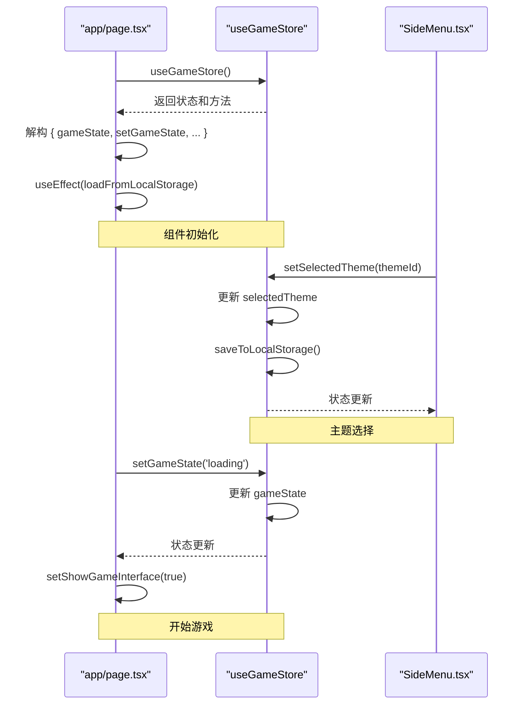

# 状态管理

<cite>
**Referenced Files in This Document**   
- [store.ts](file://lib/store.ts)
- [page.tsx](file://app/page.tsx)
- [SideMenu.tsx](file://components/SideMenu.tsx)
- [index.ts](file://types/index.ts)
</cite>

## 目录
1. [简介](#简介)
2. [核心状态模型](#核心状态模型)
3. [状态访问与修改](#状态访问与修改)
4. [状态持久化机制](#状态持久化机制)
5. [状态流转示例](#状态流转示例)
6. [数据结构定义](#数据结构定义)

## 简介

本项目采用Zustand作为全局状态管理解决方案，为游戏应用提供统一的状态管理机制。`lib/store.ts`文件定义了`useGameStore`，作为整个应用的单一状态源（Single Source of Truth），集中管理游戏状态、主题选择、游戏数据、玩家位置等核心信息。该状态管理方案确保了组件间的数据一致性，并通过React的上下文机制实现状态的高效共享。

**Section sources**
- [store.ts](file://lib/store.ts#L0-L312)

## 核心状态模型

`useGameStore`定义了`GameStore`接口，包含应用所需的所有核心状态及其更新方法。主要状态包括：

- **游戏状态 (gameState)**: 枚举类型，表示当前游戏所处的阶段，包括`menu`（菜单）、`loading`（加载）和`playing`（游戏中）。
- **主题选择 (selectedTheme)**: 枚举类型，表示当前选中的游戏主题，支持`fantasy`（魔幻）、`cyberpunk`（赛博朋克）和`custom`（自定义）。
- **游戏数据 (gameData)**: 包含游戏核心数据的对象，其`data`属性中包含`characterUrl`（角色图像URL）和`levels`（关卡数组）。
- **玩家位置 (playerPosition)**: 一个包含`x`和`y`坐标的对象，用于跟踪玩家在游戏世界中的位置。

这些状态通过Zustand的`create`函数进行创建和管理，确保了状态的响应式更新。

```mermaid
classDiagram
class GameStore {
+gameState : GameState
+selectedTheme : GameTheme
+gameData : GameData
+playerPosition : {x : number, y : number}
+setGameState(state : GameState) : void
+setSelectedTheme(theme : GameTheme) : void
+setGameData(data : GameData) : void
+setPlayerPosition(position : {x : number, y : number}) : void
+saveToLocalStorage() : void
+loadFromLocalStorage() : void
}
class GameState {
<<enumeration>>
menu
loading
playing
}
class GameTheme {
<<enumeration>>
fantasy
cyberpunk
custom
}
class GameData {
+success? : boolean
+data? : GameDataDetail
+generationId? : string
+timestamp? : string
}
class GameDataDetail {
+characterUrl : string
+levels : LevelData[]
}
class LevelData {
+id : string
+backgroundUrl : string
+groundUrl? : string
+obstacleUrl? : string
+obstacles : Obstacle[]
}
GameStore --> GameState : "uses"
GameStore --> GameTheme : "uses"
GameStore --> GameData : "contains"
GameData --> GameDataDetail : "has"
GameDataDetail --> LevelData : "contains"
```

**Diagram sources**
- [store.ts](file://lib/store.ts#L51-L127)
- [store.ts](file://lib/store.ts#L0-L49)

**Section sources**
- [store.ts](file://lib/store.ts#L51-L127)

## 状态访问与修改

应用中的组件通过导入`useGameStore` Hook来访问和修改全局状态。`app/page.tsx`作为应用的主入口，是状态的主要消费者。

### 主入口组件 (app/page.tsx)

`app/page.tsx`通过解构`useGameStore`来获取所需的状态和更新函数。例如，它获取`gameState`、`setGameState`、`selectedTheme`、`setSelectedTheme`以及`gameData`等。该组件根据`showGameInterface`的状态来决定渲染`SideMenu`和`ThemesList`（菜单界面）还是`GameCanvas`（游戏界面）。当用户点击“开始游戏”时，`handleStartGame`函数被调用，它会触发`setGameState('playing')`来改变游戏状态。



**Diagram sources**
- [page.tsx](file://app/page.tsx#L1-L244)
- [store.ts](file://lib/store.ts#L129-L312)

**Section sources**
- [page.tsx](file://app/page.tsx#L1-L244)

### 其他组件 (SideMenu.tsx)

其他组件，如`components/SideMenu.tsx`，同样通过`useGameStore`来访问状态。`SideMenu`组件在用户点击“创建主题”按钮后，会调用`setGameState('loading')`来更新状态，从而触发UI的加载动画。它还通过`setGameData`来存储从API获取的游戏数据（如角色和关卡图像的URL）。

**Section sources**
- [SideMenu.tsx](file://components/SideMenu.tsx#L1-L298)

## 状态持久化机制

为了实现跨会话的状态保存，特别是自定义主题的持久化，系统实现了基于`localStorage`的持久化机制。

### 持久化实现

`useGameStore`定义了两个核心方法：`saveToLocalStorage`和`loadFromLocalStorage`。`saveToLocalStorage`方法在每次关键状态更新后被调用（例如，当`selectedTheme`或`gameData`发生变化时），它会将`gameData`、`processedImages`、`selectedTheme`和`customPrompt`等关键数据序列化为JSON字符串，并存储到`localStorage`中，键名为`pixel-seed-game-data`。`loadFromLocalStorage`方法在应用初始化时被`app/page.tsx`调用，它会尝试从`localStorage`中读取数据，如果存在，则将状态恢复到上次会话的值。

```mermaid
flowchart TD
A[应用初始化] --> B{localStorage有数据?}
B --> |是| C[调用 loadFromLocalStorage]
C --> D[从 localStorage 读取 JSON]
D --> E[解析 JSON 数据]
E --> F[调用 set() 恢复状态]
F --> G[应用启动]
B --> |否| G
H[状态变更] --> I[调用 saveToLocalStorage]
I --> J[收集需持久化的状态]
J --> K[序列化为 JSON]
K --> L[存入 localStorage]
L --> M[状态更新完成]
```

**Diagram sources**
- [store.ts](file://lib/store.ts#L246-L280)
- [page.tsx](file://app/page.tsx#L58-L62)

**Section sources**
- [store.ts](file://lib/store.ts#L246-L280)

## 状态流转示例

以下是一个典型的用户操作流程，展示了状态如何在不同组件间流转：

1.  **初始状态**: 应用启动，`gameState`初始值为`menu`。
2.  **选择主题**: 用户在`SideMenu`中选择一个主题，`setSelectedTheme`被调用，`selectedTheme`状态更新，并自动触发`saveToLocalStorage`。
3.  **开始游戏**: 用户点击“开始游戏”按钮，`app/page.tsx`中的`handleStartGame`被调用。
4.  **进入加载状态**: `handleStartGame`会先调用`setGameState('loading')`，将`gameState`从`menu`流转到`loading`。这会触发UI显示加载动画。
5.  **获取游戏数据**: 在`SideMenu`中，`handleCreateTheme`函数会调用API生成游戏数据。数据返回后，`setGameData`被调用，将`characterUrl`和`levels`等信息存入`gameData`。
6.  **进入游戏状态**: 数据加载完成后，`setGameState('playing')`被调用，`gameState`从`loading`流转到`playing`。
7.  **渲染游戏**: `app/page.tsx`检测到`gameState`为`playing`，于是渲染`GameCanvas`组件，游戏正式开始。

此流程确保了状态变更的清晰和可预测性。

**Section sources**
- [store.ts](file://lib/store.ts#L129-L169)
- [page.tsx](file://app/page.tsx#L128-L132)
- [SideMenu.tsx](file://components/SideMenu.tsx#L108-L114)

## 数据结构定义

核心数据结构在`types/index.ts`和`lib/store.ts`中定义，确保了类型安全。

### 核心接口

- **`GameStore`**: 定义了全局状态的完整结构，包含所有状态字段和更新方法。
- **`GameData`**: 定义了游戏数据的结构，包含`characterUrl`和`levels`数组。
- **`LevelData`**: 定义了单个关卡的数据结构，包含背景、地面、障碍物的URL和具体的障碍物列表。

这些接口在多个文件中被导入和使用，保证了数据结构的一致性。

**Section sources**
- [index.ts](file://types/index.ts#L0-L122)
- [store.ts](file://lib/store.ts#L0-L49)