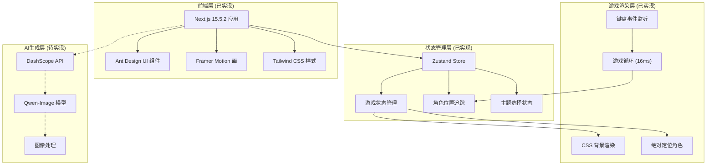

# 项目介绍

<cite>
**本文档引用文件**   
- [PRD.md](file://PRD.md)
- [app/page.tsx](file://app/page.tsx)
- [app/api/generate/route.ts](file://app/api/generate/route.ts)
- [app/api/process-image/route.ts](file://app/api/process-image/route.ts)
- [lib/store.ts](file://lib/store.ts)
- [components/GameCanvas.tsx](file://components/GameCanvas.tsx)
- [components/SideMenu.tsx](file://components/SideMenu.tsx)
- [components/ThemePreview.tsx](file://components/ThemePreview.tsx)
- [configs/index.ts](file://configs/index.ts)
- [next.config.ts](file://next.config.ts)
</cite>

## 目录
1. [核心理念与愿景](#核心理念与愿景)
2. [技术架构与实现](#技术架构与实现)
3. [AI生成系统详解](#ai生成系统详解)
4. [游戏交互与渲染](#游戏交互与渲染)
5. [状态管理与数据流](#状态管理与数据流)
6. [系统架构图](#系统架构图)

## 核心理念与愿景

Pixel Seed 项目的核心理念是“一粒种子，一个世界”（A Seed, A World）。该项目旨在通过人工智能技术，将用户输入的主题或提示词转化为可玩的2D像素风游戏世界。用户无需具备美术基础，只需选择预设主题或输入自定义提示词，系统即可调用大模型生成专属的像素风角色形象和关卡背景，动态构建游戏世界。

项目背景源于传统像素游戏开发受限于美术资源制作周期长、风格固化的问题。随着AI图像生成技术的发展，特别是大模型在风格化图像生成上的突破，构建一个“AI即内容引擎”的游戏平台成为可能。Pixel Seed 正是这一理念的实验性验证，通过大语言模型与图像生成模型的结合，实现“输入一个种子（Seed），生成一个世界”的愿景。

项目目标包括：实现“AI生成+即时游戏化”的闭环流程；验证使用大模型生成高质量、风格统一的像素美术资源的可行性；构建可扩展的架构，支持未来加入更多游戏玩法、主题风格和交互机制。

**Section sources**
- [PRD.md](file://PRD.md#L1-L100)

## 技术架构与实现

Pixel Seed 是一个基于 Next.js 的全栈应用，前端使用 Next.js 15.5.2 框架，结合 Tailwind CSS 进行样式设计，Ant Design 作为 UI 组件库，Framer Motion 提供动画效果。状态管理采用 Zustand，并结合 localStorage 实现数据持久化。

后端技术栈包括 Next.js API Routes 作为 API 路由，计划使用 PostgreSQL + Prisma ORM 作为数据库，AWS S3 或 Cloudinary 作为文件存储，Redis 用于缓存，Bull Queue 处理 AI 生成任务。

AI 集成方面，项目使用阿里云的 Qwen-Image 模型，通过 DashScope API 进行调用。API 认证使用 Bearer Token，调用方式为 HTTP 同步接口。图像规格方面，角色为 1328x1328px，背景为 1664x928px，地面和障碍物支持多种尺寸。并发控制使用 Promise.all 并行处理多种图像类型生成，并包含智能延迟机制防止 API 限流。

**Section sources**
- [PRD.md](file://PRD.md#L300-L400)
- [next.config.ts](file://next.config.ts#L1-L28)

## AI生成系统详解

AI 生成系统是 Pixel Seed 的核心，包括角色生成和关卡背景生成两个主要部分。系统通过 `/api/generate` API 端点接收前端请求，验证参数后，根据主题和用户输入构建具体的提示词，并同时调用 DashScope Qwen-Image API 生成角色和背景。

生成流程包括：前端用户选择主题或输入自定义提示词，点击生成按钮后，前端显示加载状态并实时进度；后端接收请求，验证参数，构建提示词，并行调用 AI 模型生成图像；对生成的图像进行格式转换和优化，上传到云存储，最后返回包含角色和背景 URL 的统一响应。

为确保生成内容精准符合 2D 横版像素风游戏风格，系统采用了详细的反向提示词约束。例如，角色生成时排除 3D 和现实风格、环境元素、错误视角和背景干扰；背景生成时排除角色元素、装备道具和不合适的风格。

**Section sources**
- [PRD.md](file://PRD.md#L400-L650)
- [app/api/generate/route.ts](file://app/api/generate/route.ts#L1-L349)

## 游戏交互与渲染

游戏渲染采用混合方案，背景使用 CSS background-image 展示，角色使用 HTML5 Canvas 绘制。这种方案结合了 CSS 的简单性和 Canvas 的灵活性，实现了高效的渲染。

游戏玩法系统包括基础交互功能，如角色显示、背景展示、基础动画（角色方向翻转、平滑位置过渡、暂停状态淡入淡出）和角色移动（支持 WASD 和方向键，跳跃、下蹲移动）。技术实现细节包括使用 Set 数据结构管理多键同时按下，setInterval 实现 16ms 间隔的游戏循环，Zustand 管理游戏状态、角色位置和动作状态，以及简单的重力系统使角色自动下落到地面。

当前阶段，项目验证了“生成资源可立即用于游戏”的可行性，功能范围限于基础展示和简单交互，不涉及复杂的游戏逻辑如碰撞检测和敌人系统。

**Section sources**
- [PRD.md](file://PRD.md#L150-L250)
- [components/GameCanvas.tsx](file://components/GameCanvas.tsx#L1-L799)

## 状态管理与数据流

项目使用 Zustand 进行全局状态管理，定义了游戏状态、主题选择、生成参数、当前动作、游戏数据、加载状态、玩家位置、地面系统、障碍物系统和碰撞检测等多个状态。状态管理架构确保了组件间的高效通信和数据一致性。

全局状态包括 `gameState`（游戏运行状态）、`selectedTheme`（当前选中的主题）、`customPrompt`（自定义提示词）、`characterType`（角色类型）、`levelType`（关卡类型）、`currentAction`（当前动作状态）、`gameData`（游戏数据对象）、`playerPosition`（玩家位置坐标）等。这些状态通过 Zustand 的 store 进行集中管理，并在组件间共享。

持久化存储使用 localStorage，用于存储用户创建的主题和游戏数据，支持主题的保存、恢复、删除和更新。组件内部状态则维护自身的 UI 状态，如表单输入状态和临时交互状态。

**Section sources**
- [lib/store.ts](file://lib/store.ts#L1-L313)
- [app/page.tsx](file://app/page.tsx#L1-L244)

## 系统架构图

**Diagram sources**
- [PRD.md](file://PRD.md#L700-L750)